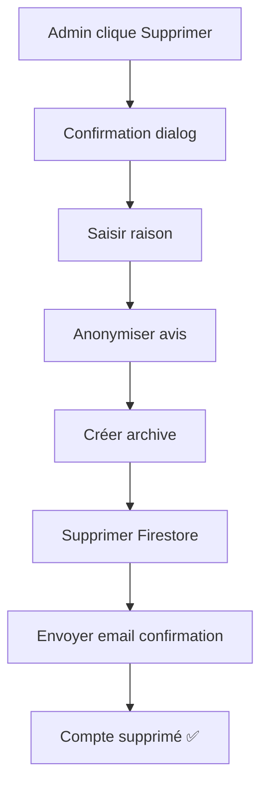
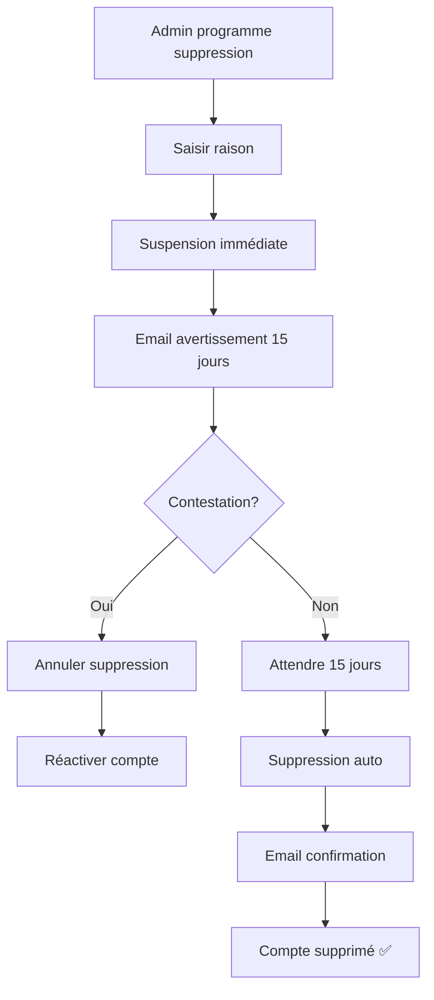

# 🗑️ GUIDE COMPLET - Suppression de Compte ArtisanSafe

## 📋 Table des matières

1. [Vue d'ensemble](#vue-densemble)
2. [Workflow de suppression](#workflow-de-suppression)
3. [Fonctions implémentées](#fonctions-implémentées)
4. [Notifications email](#notifications-email)
5. [Données conservées vs supprimées](#données-conservées-vs-supprimées)
6. [Guide d'utilisation admin](#guide-dutilisation-admin)
7. [Configuration requise](#configuration-requise)

---

## 🎯 Vue d'ensemble

Le système de suppression de compte ArtisanSafe respecte les obligations **RGPD** et garantit :
- ✅ **Notification obligatoire** à l'utilisateur
- ✅ **Période de recours** de 15 jours
- ✅ **Anonymisation** des avis publiés
- ✅ **Archivage** des données légales (contrats, transactions)
- ✅ **Suppression complète** des données personnelles

---

## 🔄 Workflow de suppression

### Option 1 : Suppression immédiate



**Utiliser pour :**
- Fraude avérée et grave
- Demande explicite de l'utilisateur (RGPD)
- Compte test/spam

### Option 2 : Suppression programmée (RECOMMANDÉ)



**Utiliser pour :**
- Documents expirés
- Comportement inapproprié (2ème infraction)
- Inactivité prolongée
- Décision administrative contestable

---

## 🛠️ Fonctions implémentées

### 1. Suppression immédiate

#### Pour les artisans :
```typescript
import { deleteArtisanAccount } from '@/lib/firebase/account-service';

await deleteArtisanAccount(
  userId,        // ID de l'artisan
  adminId,       // ID admin (ex: 'admin_temp')
  adminName,     // Nom admin (ex: 'Admin')
  reason         // Raison de suppression
);
```

#### Pour les clients :
```typescript
import { deleteClientAccount } from '@/lib/firebase/account-service';

await deleteClientAccount(
  userId,        // ID du client
  adminId,       // ID admin
  adminName,     // Nom admin
  reason         // Raison de suppression
);
```

**Actions effectuées :**
1. ✅ Récupération des données utilisateur
2. ✅ Anonymisation des avis (auteur → "[Compte supprimé]")
3. ✅ Création d'une archive dans `deleted_accounts`
4. ✅ Suppression Firestore (`users` + `artisans`)
5. ✅ Envoi email de confirmation
6. ⚠️ Suppression Firebase Auth (nécessite backend - voir ci-dessous)

---

### 2. Suppression programmée (avec période de recours)

```typescript
import { scheduleAccountDeletion } from '@/lib/firebase/account-service';

await scheduleAccountDeletion(
  userId,              // ID utilisateur
  'artisan',           // Type: 'artisan' ou 'client'
  reason,              // Raison
  adminId,             // ID admin
  adminName,           // Nom admin
  15                   // Délai en jours (par défaut: 15)
);
```

**Actions effectuées :**
1. ✅ Calcul date de suppression (aujourd'hui + 15 jours)
2. ✅ Création document `scheduled_deletions/userId`
3. ✅ Suspension immédiate du compte
4. ✅ Envoi email d'avertissement avec date limite
5. ⏰ Attente automatique 15 jours
6. ✅ Suppression automatique à échéance (via Cloud Function)

---

### 3. Annuler une suppression programmée

```typescript
import { cancelScheduledDeletion } from '@/lib/firebase/account-service';

await cancelScheduledDeletion(
  userId,        // ID utilisateur
  adminId,       // ID admin
  adminName      // Nom admin
);
```

**Actions effectuées :**
1. ✅ Récupération du document `scheduled_deletions/userId`
2. ✅ Marquage `status: 'cancelled'`
3. ✅ Réactivation automatique du compte
4. ✅ Envoi email de réactivation

---

### 4. Exécuter les suppressions programmées

**⚠️ IMPORTANT : Cette fonction doit être appelée quotidiennement via Cloud Function**

```typescript
import { executePendingDeletions } from '@/lib/firebase/account-service';

// À appeler via Cloud Scheduler tous les jours
const result = await executePendingDeletions();
console.log(`${result.deletedCount} comptes supprimés`);
console.log(`Erreurs: ${result.errors}`);
```

**Configuration Cloud Function (Firebase) :**
```typescript
// functions/src/index.ts
import * as functions from 'firebase-functions';
import { executePendingDeletions } from './account-service';

export const dailyAccountDeletion = functions.pubsub
  .schedule('every day 03:00')
  .timeZone('Europe/Paris')
  .onRun(async (context) => {
    await executePendingDeletions();
  });
```

---

## 📧 Notifications email

### Templates créés

Le service `email-notification-service.ts` fournit 4 templates :

#### 1. **Avertissement de suppression** (15 jours avant)
- Sujet : "⚠️ Avertissement : Suppression de votre compte ArtisanSafe"
- Contenu : Raison, date limite, données supprimées/conservées, contact support
- Déclencheur : `scheduleAccountDeletion()`

#### 2. **Confirmation de suppression**
- Sujet : "🗑️ Confirmation : Votre compte ArtisanSafe a été supprimé"
- Contenu : Confirmation suppression, liste données effacées, droits RGPD
- Déclencheur : `deleteArtisanAccount()` / `deleteClientAccount()`

#### 3. **Suspension de compte**
- Sujet : "🔒 Suspension de votre compte ArtisanSafe"
- Contenu : Raison, conséquences, caractère temporaire
- Déclencheur : `suspendArtisan()` / `suspendClient()`

#### 4. **Réactivation de compte**
- Sujet : "✅ Réactivation de votre compte ArtisanSafe"
- Contenu : Confirmation réactivation, lien connexion
- Déclencheur : `reactivateArtisan()` / `reactivateClient()`

### Envoi des emails

Les emails sont **stockés dans Firestore** pour être traités par une Cloud Function :

```firestore
collection: email_notifications
{
  to: "artisan@example.com",
  subject: "...",
  htmlContent: "...",
  textContent: "...",
  type: "account_deletion",
  createdAt: Timestamp,
  status: "pending"  // puis "sent" ou "failed"
}
```

**Configuration Cloud Function pour l'envoi :**
```typescript
// functions/src/index.ts
import * as functions from 'firebase-functions';
import * as nodemailer from 'nodemailer';

export const sendEmail = functions.firestore
  .document('email_notifications/{emailId}')
  .onCreate(async (snap, context) => {
    const emailData = snap.data();
    
    const transporter = nodemailer.createTransport({
      service: 'gmail',
      auth: {
        user: functions.config().email.user,
        pass: functions.config().email.password
      }
    });

    await transporter.sendMail({
      from: '"ArtisanSafe" <noreply@artisandispo.fr>',
      to: emailData.to,
      subject: emailData.subject,
      html: emailData.htmlContent,
      text: emailData.textContent
    });

    await snap.ref.update({ status: 'sent' });
  });
```

---

## 💾 Données conservées vs supprimées

### ❌ Données SUPPRIMÉES (RGPD - Droit à l'oubli)

```typescript
// Collection 'users' - SUPPRIMÉ COMPLÈTEMENT
- email ❌
- nom, prénom ❌
- téléphone ❌
- adresse ❌
- documents (KBIS, assurance, pièce identité) ❌
- photos de profil ❌

// Collection 'artisans' - SUPPRIMÉ COMPLÈTEMENT
- Profil complet ❌
- Portfolio (photos travaux) ❌
- Disponibilités ❌
- Zones d'intervention ❌
- Métiers ❌

// Collection 'messages' - SUPPRIMÉ après 90 jours
- Conversations privées ❌
```

### ✅ Données CONSERVÉES (Obligations légales)

```typescript
// Collection 'avis' - ANONYMISÉ
{
  auteurNom: "[Compte supprimé]",  // ← anonymisé
  auteurEmail: null,                // ← supprimé
  auteurId: null,                   // ← supprimé
  note: 4.5,                        // ✅ conservé
  commentaire: "Excellent travail", // ✅ conservé
  anonymized: true,
  anonymizedAt: Timestamp
}

// Collection 'contrats' - ARCHIVÉ (10 ans)
{
  artisanId: null,                  // ← anonymisé
  clientId: "...",                  // ✅ conservé si client OK
  montant: 1500,                    // ✅ conservé
  dateSignature: Timestamp,         // ✅ conservé
  status: "completed"               // ✅ conservé
}

// Collection 'transactions' - ARCHIVÉ (10 ans)
{
  userId: "DELETED_xxx",            // ← anonymisé
  montant: 1500,                    // ✅ conservé
  date: Timestamp,                  // ✅ conservé
  stripePaymentId: "pi_xxx"         // ✅ conservé
}

// Collection 'deleted_accounts' - ARCHIVÉ
{
  type: "artisan",
  deletedAt: Timestamp,
  deletedBy: "admin_temp",
  reason: "Fraude avérée",
  siret: "123456789",               // statistiques fraude
  metiers: ["plomberie"],           // statistiques plateforme
  dateInscription: Timestamp
}
```

---

## 👨‍💼 Guide d'utilisation admin

### Depuis `/admin/comptes`

#### 1. Suppression immédiate

1. Cliquer sur **"Supprimer"** à côté du compte
2. Saisir la **raison de suppression**
3. Confirmer avec **double validation**
4. ✅ Email envoyé automatiquement à l'utilisateur
5. ✅ Compte supprimé immédiatement

#### 2. Suppression programmée (RECOMMANDÉ)

**Option A : Via interface admin (à implémenter)**
```tsx
// Dans admin/comptes/page.tsx - Ajouter bouton
<button onClick={() => handleScheduleDeletion(account)}>
  📅 Programmer suppression (15 jours)
</button>
```

**Option B : Via console Firebase**
```javascript
// Console Firestore - Exécuter code
import { scheduleAccountDeletion } from './account-service';

await scheduleAccountDeletion(
  'USER_ID_ICI',
  'artisan',
  'Documents expirés - KBIS obsolète',
  'admin_temp',
  'Admin Principal',
  15
);
```

#### 3. Consulter les suppressions programmées

**Collection Firestore : `scheduled_deletions`**

```javascript
// Filtrer par statut
Status: 'scheduled'   // En attente
Status: 'executed'    // Exécutée
Status: 'cancelled'   // Annulée
```

**Interface admin suggérée :**
```
Suppressions programmées
┌─────────────────────────────────────────────────┐
│ Nom         | Type    | Raison       | Date    │
├─────────────────────────────────────────────────┤
│ Jean Dupont | Artisan | Docs expirés | 17/01   │  [Annuler]
│ Marie L.    | Client  | Inactif      | 20/01   │  [Annuler]
└─────────────────────────────────────────────────┘
```

---

## ⚙️ Configuration requise

### 1. Firestore Collections

Créer les collections suivantes :

```
/email_notifications     (emails en attente d'envoi)
/scheduled_deletions     (suppressions programmées)
/deleted_accounts        (archives anonymisées)
/avis                    (pour anonymisation)
```

### 2. Firestore Rules

```javascript
// firestore.rules
rules_version = '2';
service cloud.firestore {
  match /databases/{database}/documents {
    
    // Emails accessibles uniquement par Cloud Functions
    match /email_notifications/{emailId} {
      allow read, write: if false;
    }
    
    // Suppressions programmées - admin uniquement
    match /scheduled_deletions/{userId} {
      allow read, write: if request.auth.uid == 'ADMIN_UID';
    }
    
    // Archives - admin uniquement
    match /deleted_accounts/{userId} {
      allow read: if request.auth.uid == 'ADMIN_UID';
      allow write: if false;
    }
  }
}
```

### 3. Cloud Functions

Déployer deux Cloud Functions :

#### A. Envoi d'emails
```bash
# functions/package.json
{
  "dependencies": {
    "firebase-functions": "^4.0.0",
    "firebase-admin": "^11.0.0",
    "nodemailer": "^6.9.0"
  }
}
```

```bash
# Configuration email
firebase functions:config:set email.user="noreply@artisandispo.fr"
firebase functions:config:set email.password="VOTRE_MOT_DE_PASSE"
```

#### B. Suppression quotidienne
```bash
# Déployer la fonction
firebase deploy --only functions:dailyAccountDeletion
```

### 4. Variables d'environnement

Aucune variable supplémentaire requise (utilise Firebase déjà configuré).

---

## 🔐 Suppression Firebase Auth (Backend requis)

**⚠️ LIMITATION ACTUELLE :**
La suppression du compte **Firebase Auth** nécessite des **privilèges admin** côté backend.

### Solution 1 : Cloud Function (RECOMMANDÉ)

```typescript
// backend/functions/src/index.ts
import * as functions from 'firebase-functions';
import * as admin from 'firebase-admin';

export const deleteUserAuth = functions.https.onCall(async (data, context) => {
  // Vérifier que l'appelant est admin
  if (!context.auth || context.auth.uid !== 'ADMIN_UID') {
    throw new functions.https.HttpsError('permission-denied', 'Admin only');
  }

  const { userId } = data;

  try {
    await admin.auth().deleteUser(userId);
    return { success: true };
  } catch (error) {
    throw new functions.https.HttpsError('internal', error.message);
  }
});
```

### Solution 2 : API Backend

```typescript
// backend/src/routes/admin.routes.ts
import { Router } from 'express';
import { auth } from '../config/firebase-admin';

const router = Router();

router.delete('/users/:userId/auth', async (req, res) => {
  try {
    // Vérifier token admin
    const token = req.headers.authorization?.split('Bearer ')[1];
    // ... vérification admin ...

    await auth.deleteUser(req.params.userId);
    res.json({ success: true });
  } catch (error) {
    res.status(500).json({ error: error.message });
  }
});

export default router;
```

### Appel depuis le frontend

```typescript
// Modifier deleteArtisanAccount() et deleteClientAccount()
import { getFunctions, httpsCallable } from 'firebase/functions';

// Après suppression Firestore
const functions = getFunctions();
const deleteAuthUser = httpsCallable(functions, 'deleteUserAuth');

await deleteAuthUser({ userId });
```

---

## 📊 Statistiques et monitoring

### Dashboard admin recommandé

```typescript
// Collecte des métriques
const stats = {
  totalDeletions: await countDocs('deleted_accounts'),
  scheduledDeletions: await countDocs('scheduled_deletions', { status: 'scheduled' }),
  deletionReasons: {
    fraud: 15,
    inactivity: 8,
    userRequest: 23,
    expiredDocs: 12
  },
  anonymizedReviews: 156
};
```

---

## ✅ Checklist déploiement

- [ ] Service email-notification créé
- [ ] Fonctions de suppression implémentées
- [ ] Anonymisation des avis fonctionnelle
- [ ] Collection `email_notifications` créée
- [ ] Collection `scheduled_deletions` créée
- [ ] Collection `deleted_accounts` créée
- [ ] Firestore Rules mises à jour
- [ ] Cloud Function `sendEmail` déployée
- [ ] Cloud Function `dailyAccountDeletion` déployée
- [ ] Cloud Function `deleteUserAuth` déployée (optionnel)
- [ ] Tests de suppression effectués
- [ ] Templates email validés
- [ ] Conformité RGPD vérifiée

---

## 🆘 Support et contact

**Questions RGPD :** rgpd@artisandispo.fr  
**Support technique :** support@artisandispo.fr  
**Documentation :** `/docs/ACCOUNT_DELETION_GUIDE.md`

---

**Version :** 1.0  
**Dernière mise à jour :** 2 janvier 2026  
**Auteur :** ArtisanSafe Development Team
