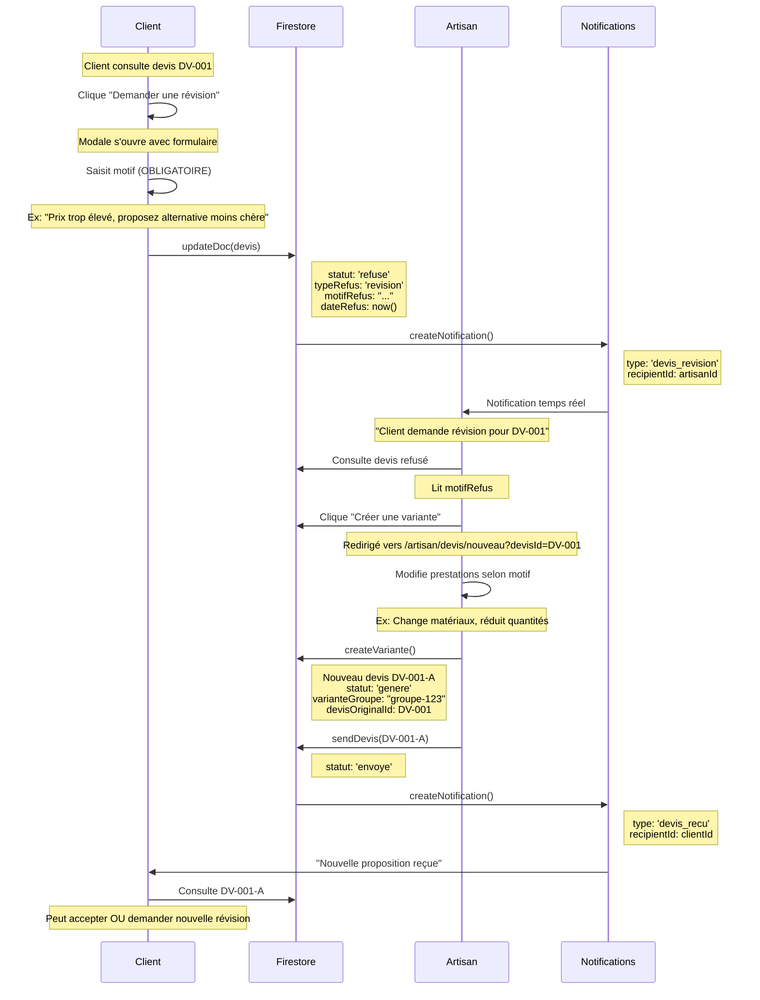
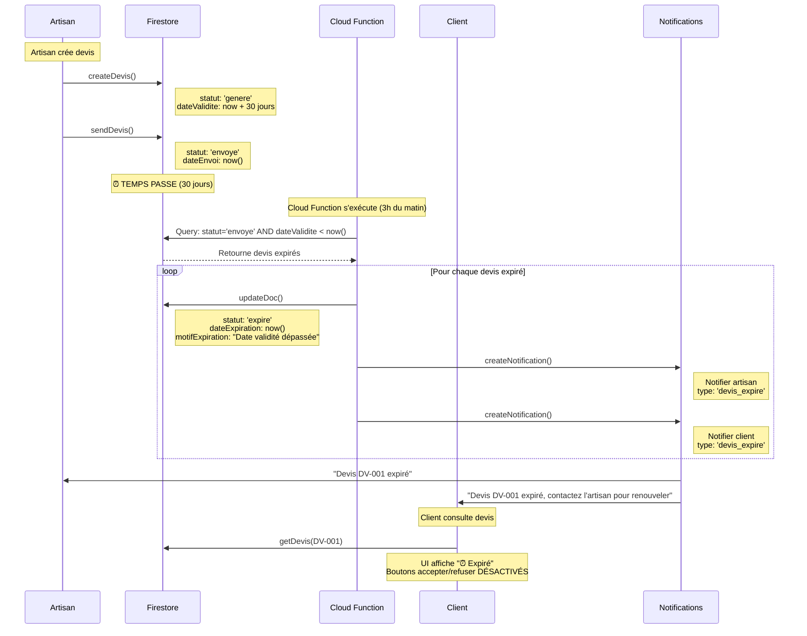
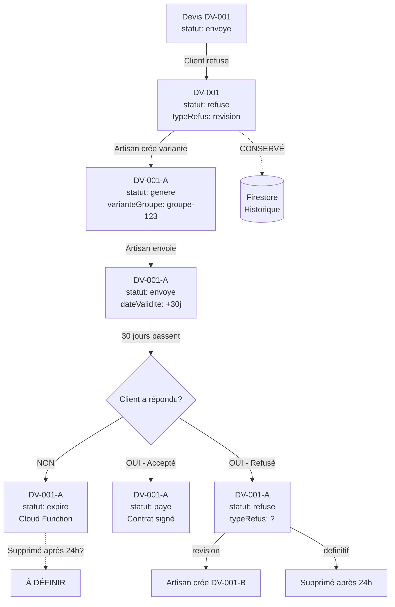

# 🔄 Cycle de vie complet d'un devis - Révision & Expiration

## 📋 Vue d'ensemble

Ce document explique en détail **deux scénarios critiques** dans le cycle de vie d'un devis :
1. **Demande de révision** (`typeRefus: 'revision'`)
2. **Expiration automatique** (`statut: 'expire'`)

---

## 🔄 SCÉNARIO 1 : Demande de révision

### 📌 Définition

Une **révision** est un **refus constructif** : le client refuse le devis actuel mais **demande à l'artisan de proposer une nouvelle option** modifiée.

### 🎯 Caractéristiques

| Propriété | Valeur |
|-----------|--------|
| **statut** | `'refuse'` |
| **typeRefus** | `'revision'` |
| **motifRefus** | **OBLIGATOIRE** (explique ce qui ne va pas) |
| **Visibilité** | ✅ **Reste visible indéfiniment** pour l'artisan |
| **Suppression** | ❌ **JAMAIS supprimé** (conservation pour historique) |
| **Artisan peut** | ✅ Créer une nouvelle variante |

---

### 🔀 Workflow détaillé : Demande de révision



---

### 💻 Code : Refus avec révision

**Fichier** : `frontend/src/app/client/devis/[id]/page.tsx` (ligne 453-480)

```typescript
// CAS 3 : DEMANDER UNE RÉVISION
else if (refusalType === 'revision' && devis.demandeId) {
  console.log('🔄 Refus avec demande de révision');
  
  // 1. Mettre à jour le devis
  await updateDoc(doc(db, 'devis', devisId), {
    statut: 'refuse',
    dateRefus: Timestamp.now(),
    motifRefus: refusalReason || 'Aucun motif précisé',
    typeRefus: 'revision',  // ← TYPE SPÉCIAL
    dateDerniereNotification: Timestamp.now(),
    vuParArtisan: false,
  });
  
  // 2. Notifier l'artisan (notification spécifique révision)
  await notifyArtisanDevisRevision(
    devis.artisanId,
    devis.demandeId,
    clientNom,
    devis.numeroDevis,
    refusalReason  // ← Motif transmis à l'artisan
  );
  
  // 3. Message utilisateur
  alert('🔄 Demande de révision envoyée.\n\nL\'artisan pourra vous proposer une nouvelle option modifiée.');
}
```

---

### 🔑 Points clés : Révision

#### ✅ Pourquoi le motif est OBLIGATOIRE ?

**Validation frontend** (ligne 384-388) :
```typescript
if (refusalType === 'revision' && !refusalReason.trim()) {
  alert('⚠️ Le motif du refus est obligatoire pour demander une nouvelle option.\n\nCela permet à l\'artisan de comprendre vos attentes et de vous proposer une offre mieux adaptée.');
  return;
}
```

**Raison** : Sans motif, l'artisan ne sait pas quoi modifier !

#### ✅ Pourquoi la révision n'est JAMAIS supprimée ?

**Script de suppression** (`backend/scripts/cleanup-devis-refuses.js` ligne 48-52) :
```typescript
// GARDER les révisions
if (typeRefus === 'revision') {
  console.log('   ✅ CONSERVÉ : Révision (artisan peut répondre)');
  devisConservesCount++;
  continue;
}
```

**Raisons** :
1. **Historique conversation** : Client et artisan ont échangé
2. **Contexte variantes** : Les variantes suivantes référencent le devis original
3. **Traçabilité** : Preuve des modifications demandées

#### ✅ Bouton "Créer une variante"

**Fichier** : `frontend/src/app/artisan/devis/page.tsx` (ligne 915-920)

```typescript
{d.statut === 'refuse' && d.typeRefus === 'revision' && d.demandeId ? (
  <button
    onClick={() => router.push(`/artisan/devis/nouveau?demandeId=${d.demandeId}&ancienDevisId=${d.id}`)}
    className="px-3 py-1 bg-blue-600 text-white rounded hover:bg-blue-700"
  >
    🔄 Créer une variante
  </button>
) : ...}
```

**Effet** : Redirige vers formulaire nouveau devis **pré-rempli** avec données du devis refusé

---

## ⏰ SCÉNARIO 2 : Expiration automatique

### 📌 Définition

Un devis **expire** quand sa **date de validité** (`dateValidite`) est dépassée et que le client n'a **ni accepté ni refusé**.

### 🎯 Caractéristiques

| Propriété | Valeur |
|-----------|--------|
| **statut** | `'expire'` |
| **dateValidite** | Date limite (par défaut : +30 jours à la création) |
| **dateExpiration** | Date réelle d'expiration (calculée automatiquement) |
| **motifExpiration** | "Date de validité dépassée" |
| **Client peut** | ❌ Plus accepter/refuser |
| **Artisan peut** | ✅ Créer un nouveau devis si besoin |

---

### 🔀 Workflow détaillé : Expiration automatique



---

### 💻 Code : Expiration automatique

#### 1️⃣ Création du devis avec dateValidite

**Fichier** : `frontend/src/app/artisan/devis/nouveau/page.tsx` (ligne 923-925)

```typescript
const nouveauDevis = {
  // ... autres champs
  dateValidite: Timestamp.fromDate(
    new Date(Date.now() + dateValidite * 24 * 60 * 60 * 1000)
  ),
  // Par défaut dateValidite = 30 jours (ligne 209)
};
```

#### 2️⃣ Cloud Function : Détecter et marquer comme expiré

**Fichier** : `functions/src/scheduledJobs/expireDevis.ts` (À CRÉER)

```typescript
/**
 * Cloud Function : Expiration automatique des devis
 * Exécution : Tous les jours à 4h du matin
 */
export const expireDevis = functions
  .region('europe-west1')
  .pubsub
  .schedule('0 4 * * *')  // 4h du matin
  .timeZone('Europe/Paris')
  .onRun(async (context) => {
    console.log('⏰ Vérification expiration devis...');
    
    const now = admin.firestore.Timestamp.now();
    
    // Récupérer devis envoyés avec dateValidite dépassée
    const devisExpiresQuery = await db
      .collection('devis')
      .where('statut', '==', 'envoye')
      .where('dateValidite', '<', now)
      .get();
    
    if (devisExpiresQuery.empty) {
      console.log('✅ Aucun devis expiré');
      return null;
    }
    
    console.log(`📊 ${devisExpiresQuery.size} devis à expirer`);
    
    const batch = db.batch();
    let count = 0;
    
    for (const docSnap of devisExpiresQuery.docs) {
      const devis = docSnap.data();
      
      // Marquer comme expiré
      batch.update(docSnap.ref, {
        statut: 'expire',
        dateExpiration: now,
        motifExpiration: 'Date de validité dépassée',
      });
      
      // Notifier artisan
      batch.set(db.collection('notifications').doc(), {
        recipientId: devis.artisanId,
        type: 'devis_expire',
        title: 'Devis expiré',
        message: `Le devis ${devis.numeroDevis} a expiré`,
        relatedId: docSnap.id,
        isRead: false,
        createdAt: now,
      });
      
      // Notifier client
      batch.set(db.collection('notifications').doc(), {
        recipientId: devis.clientId,
        type: 'devis_expire',
        title: 'Devis expiré',
        message: `Le devis ${devis.numeroDevis} a expiré. Contactez l'artisan pour renouveler`,
        relatedId: docSnap.id,
        isRead: false,
        createdAt: now,
      });
      
      count++;
      console.log(`   ⏰ Expiré: ${devis.numeroDevis}`);
    }
    
    await batch.commit();
    console.log(`✅ ${count} devis expirés`);
    
    return { success: true, count };
  });
```

#### 3️⃣ UI : Affichage devis expiré

**Fichier** : `frontend/src/app/client/devis/[id]/page.tsx` (ligne 700-720)

```typescript
{devis.statut === 'expire' && (
  <div className="bg-orange-50 border-l-4 border-orange-500 p-4 mb-6">
    <div className="flex items-center">
      <svg className="w-6 h-6 text-orange-500 mr-3" fill="currentColor" viewBox="0 0 20 20">
        <path fillRule="evenodd" d="M10 18a8 8 0 100-16 8 8 0 000 16zm1-12a1 1 0 10-2 0v4a1 1 0 00.293.707l2.828 2.829a1 1 0 101.415-1.415L11 9.586V6z" clipRule="evenodd" />
      </svg>
      <div>
        <p className="font-semibold text-orange-800">
          Ce devis a expiré le {devis.dateValidite?.toDate().toLocaleDateString('fr-FR')}
        </p>
        <p className="text-sm text-orange-700">
          Vous ne pouvez plus l'accepter ou le refuser. Contactez l'artisan pour obtenir un nouveau devis.
        </p>
      </div>
    </div>
  </div>
)}

{/* Boutons désactivés si expiré */}
{devis.statut === 'envoye' && (
  <div className="flex gap-4">
    <button
      onClick={handleAccepter}
      disabled={devis.statut === 'expire'}  // ← Désactivé
      className={`
        flex-1 py-3 rounded-lg font-semibold
        ${devis.statut === 'expire' 
          ? 'bg-gray-300 text-gray-500 cursor-not-allowed' 
          : 'bg-green-600 text-white hover:bg-green-700'
        }
      `}
    >
      ✅ Accepter et payer
    </button>
    
    <button
      onClick={() => setShowRefusalModal(true)}
      disabled={devis.statut === 'expire'}  // ← Désactivé
      className={`
        flex-1 py-3 rounded-lg font-semibold
        ${devis.statut === 'expire'
          ? 'bg-gray-300 text-gray-500 cursor-not-allowed'
          : 'border-2 border-red-600 text-red-600 hover:bg-red-50'
        }
      `}
    >
      ❌ Refuser
    </button>
  </div>
)}
```

---

### 🔑 Points clés : Expiration

#### ✅ Pourquoi 30 jours par défaut ?

**Durée légale** : En France, un devis est valable **minimum 3 mois** pour travaux > 1500€ (article L111-2 Code consommation). Mais ici 30 jours car marketplace rapide.

**Modifiable** : L'artisan peut changer la durée (7, 15, 30, 60, 90 jours)

```typescript
// frontend/src/app/artisan/devis/nouveau/page.tsx ligne 1359-1370
<select
  value={dateValidite}
  onChange={(e) => setDateValidite(parseInt(e.target.value) || 30)}
  className="..."
>
  <option value={7}>7 jours</option>
  <option value={15}>15 jours</option>
  <option value={30}>30 jours (recommandé)</option>
  <option value={60}>60 jours</option>
  <option value={90}>90 jours</option>
</select>
```

#### ✅ Différence : 'expire' vs 'refuse'

| Critère | `statut: 'expire'` | `statut: 'refuse'` |
|---------|--------------------|--------------------|
| **Qui décide** | ⏰ Automatique (date) | 👤 Client (action) |
| **Peut renouveler** | ✅ Artisan crée nouveau devis | ✅ Artisan crée variante (si révision) |
| **Motif** | "Date validité dépassée" | Motif client |
| **Suppression 24h** | ❓ À définir (actuellement conservé) | ✅ OUI (sauf révision) |

#### ✅ Statuts qui peuvent expirer

**Seul statut concerné** : `'envoye'`

**Ne peuvent PAS expirer** :
- ❌ `'genere'` (pas encore envoyé)
- ❌ `'en_attente_paiement'` (client a déjà signé)
- ❌ `'paye'` (contrat juridique)
- ❌ `'refuse'` (client a déjà refusé)
- ❌ `'accepte'` (déjà accepté)

---

## 🔀 SCÉNARIO 3 : Révision PUIS Expiration

### Cas complexe : Que se passe-t-il si...

**Question** : Client demande révision → Artisan crée variante → Variante expire ?

**Réponse** :



**Résultat** :
- ✅ **DV-001** (révision originale) : **CONSERVÉ** indéfiniment
- ❓ **DV-001-A** (variante expirée) : **À DÉFINIR** - Faut-il supprimer après 24h ?

---

## 📊 Tableau récapitulatif : Tous les statuts de refus/expiration

| statut | typeRefus | Raison | Visible artisan | Suppression 24h | Client peut refaire action |
|--------|-----------|--------|-----------------|-----------------|---------------------------|
| `'refuse'` | `'revision'` | Client demande modification | ✅ OUI (toujours) | ❌ JAMAIS | ✅ Oui (nouvelle variante) |
| `'refuse'` | `'variante'` | Client refuse cette option | ✅ OUI (24h) | ✅ OUI | ✅ Oui (autres variantes) |
| `'refuse'` | `'artisan'` | Client bloque artisan | ✅ OUI (24h) | ✅ OUI | ❌ Non (bloqué) |
| `'refuse'` | `'automatique'` | Demande déjà attribuée | ✅ OUI (24h) | ✅ OUI | ❌ Non (trop tard) |
| `'refuse'` | `'definitif'` | Refus sans suite | ✅ OUI (24h) | ✅ OUI | ❌ Non |
| `'expire'` | - | Date validité dépassée | ✅ OUI | ❓ À définir | ✅ Oui (nouveau devis) |
| `'annule'` | - | Paiement non effectué (24h) | ✅ OUI | ❓ À définir | ✅ Oui (nouveau devis) |

---

## 🚀 Actions recommandées

### ✅ Cloud Function à créer : `expireDevis`

**Fichier** : `functions/src/scheduledJobs/expireDevis.ts`

**Déploiement** :
```bash
cd functions
firebase deploy --only functions:expireDevis
```

**Exécution** : Tous les jours à 4h du matin

---

### ✅ Décision à prendre : Suppression devis expirés

**Question** : Faut-il supprimer les devis `statut: 'expire'` après 24h ?

**Option A : OUI (cohérence avec refus)**
```typescript
// Dans cleanupRefusedDevis.ts
if (
  (typeRefus === 'artisan' || typeRefus === 'variante' || typeRefus === 'automatique' || typeRefus === 'definitif') ||
  devis.statut === 'expire'  // ← Ajouter ici
) {
  // Supprimer après 24h
}
```

**Option B : NON (conservation historique)**
- Justification : Devis expiré = client passif (pas de refus actif)
- Artisan peut vouloir consulter pourquoi ça n'a pas abouti

**Recommandation** : **Option A** (cohérence + économie stockage Firestore)

---

### ✅ Script de migration : Ajouter dateExpiration aux devis existants

**Fichier** : `backend/scripts/migrate-add-date-expiration.js`

```javascript
// Pour tous les devis avec statut='expire' mais sans dateExpiration
const devisExpiresSansDate = await db
  .collection('devis')
  .where('statut', '==', 'expire')
  .get();

for (const doc of devisExpiresSansDate.docs) {
  await doc.ref.update({
    dateExpiration: admin.firestore.FieldValue.serverTimestamp(),
    motifExpiration: 'Date de validité dépassée (migration)',
  });
}
```

---

## 📚 Ressources

- **Code révision** : `frontend/src/app/client/devis/[id]/page.tsx` (ligne 453-480)
- **Code expiration** : `functions/src/scheduledJobs/expireDevis.ts` (À CRÉER)
- **Code suppression** : `backend/scripts/cleanup-devis-refuses.js`
- **Types** : `frontend/src/types/devis.ts`
- **Documentation** : `docs/SUPPRESSION_AUTO_DEVIS_REFUSES.md`
