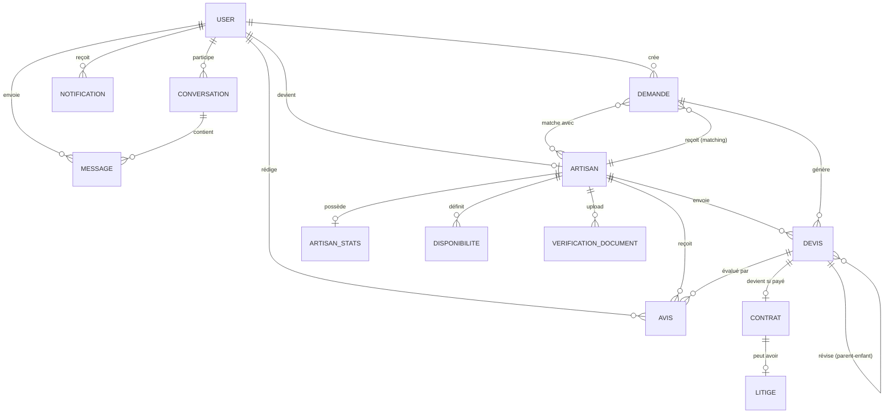
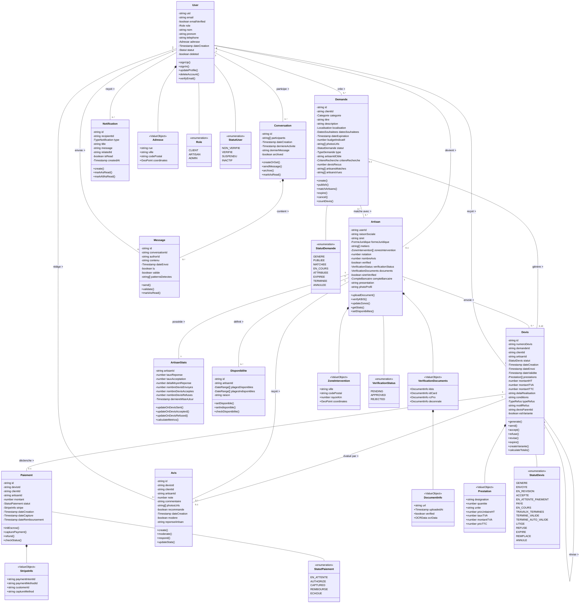
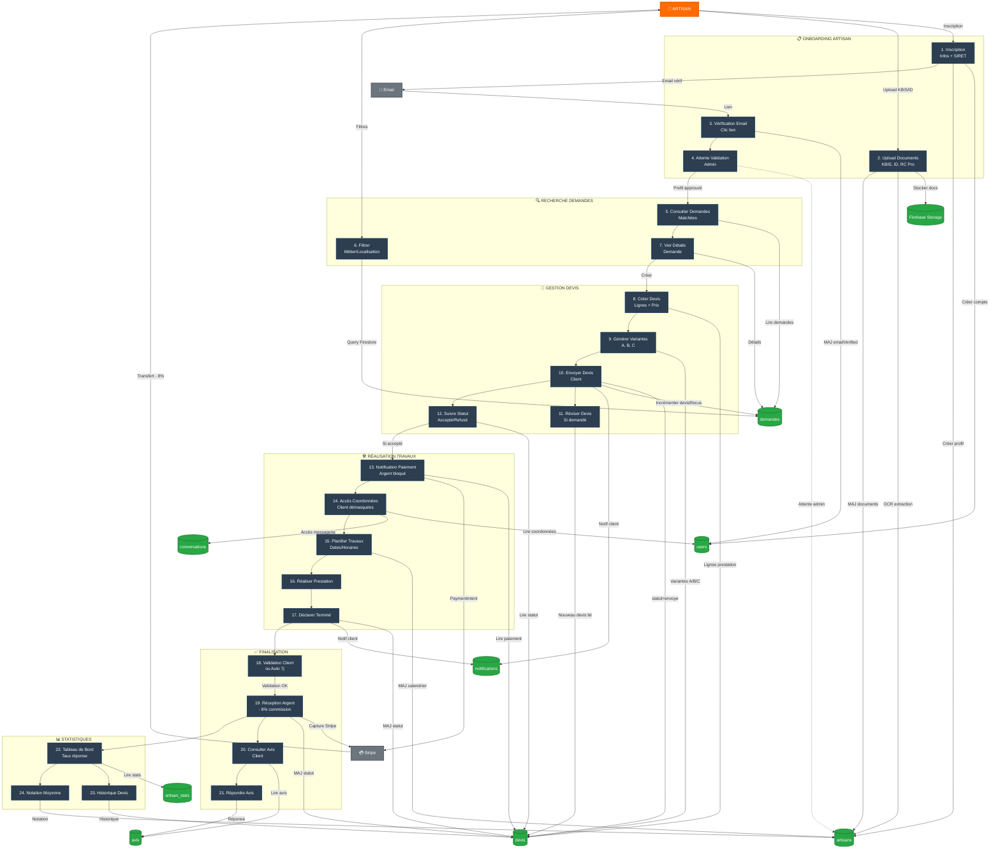

# Modèle Conceptuel de Données - ArtisanSafe

> **Marketplace bilingue** connectant clients et artisans vérifiés avec paiement sécurisé (escrow)

---

## 📊 Diagramme Entité-Association



---

## 🗂️ Entités Principales

### 1. **USER** (Collection: `users`)
**Rôle :** Utilisateur du système (Client, Artisan ou Admin)

| Attribut | Type | Description |
|----------|------|-------------|
| `uid` | string (PK) | ID Firebase Auth |
| `email` | string | Email unique |
| `emailVerified` | boolean | Statut vérification email |
| `role` | enum | `client` \| `artisan` \| `admin` |
| `nom` | string | Nom de famille |
| `prenom` | string | Prénom |
| `representantLegal` | string? | Nom représentant légal (artisans) |
| `telephone` | string | Numéro de téléphone |
| `adresse` | object? | Rue, ville, code postal, lat/lng |
| `dateCreation` | Timestamp | Date d'inscription |
| `statut` | enum | `non_verifie` \| `verifie` \| `suspendu` \| `inactif` |
| `preferencesNotifications` | object | Email, push, SMS |

**Contraintes :**
- ✅ Email unique
- ✅ Un user peut avoir 0 ou 1 profil artisan
- ✅ Soft delete avec `deleted`, `deletedAt`, `deletedBy`

---

### 2. **ARTISAN** (Collection: `artisans`)
**Rôle :** Profil professionnel public de l'artisan

| Attribut | Type | Description |
|----------|------|-------------|
| `userId` | string (PK, FK→User) | Référence utilisateur |
| `raisonSociale` | string | Nom entreprise |
| `siret` | string (14 chiffres) | SIRET vérifié |
| `formeJuridique` | enum | `auto_entrepreneur` \| `eurl` \| `sarl` \| `sas` |
| `metiers` | array\<string\> | [`plomberie`, `electricite`, ...] |
| `zonesIntervention` | array\<object\> | Ville, code postal, rayon km, lat/lng |
| `disponibilites` | array\<object\> | Créneaux hebdo/ponctuels |
| `notation` | number | Moyenne 0-5 |
| `nombreAvis` | number | Total avis reçus |
| `verified` | boolean | Profil complètement vérifié |
| `verificationStatus` | enum | `pending` \| `approved` \| `rejected` |
| `verificationDocuments` | object | KBIS, idCard, rcPro, decennale |
| `siretVerified` | boolean | SIRET validé via API SIRENE |
| `compteBancaire` | object? | IBAN, BIC, titulaire |
| `presentation` | string? | Biographie |
| `photoProfil` | string? | URL Firebase Storage |

**Contraintes :**
- ✅ `userId` unique (1-1 avec User)
- ✅ SIRET 14 chiffres
- ✅ Profil visible uniquement si `emailVerified=true` ET `verificationStatus='approved'`

**Documents de vérification :**
```typescript
verificationDocuments: {
  kbis: { url, uploadedAt, verified, ocrData: { siret, raisonSociale, representantLegal } },
  idCard: { url, uploadedAt, verified },
  rcPro: { url, uploadedAt, verified },
  decennale: { url, uploadedAt, verified }
}
```

---

### 3. **DEMANDE** (Collection: `demandes`)
**Rôle :** Demande de prestation créée par un client

| Attribut | Type | Description |
|----------|------|-------------|
| `id` | string (PK) | Auto-généré Firestore |
| `clientId` | string (FK→User) | Client créateur |
| `categorie` | enum | Métier recherché |
| `titre` | string | Titre court |
| `description` | string | Description détaillée |
| `localisation` | object | Adresse, ville, code postal, GPS |
| `datesSouhaitees` | object | Dates, flexible, urgence |
| `dateExpiration` | Timestamp? | Date limite validité |
| `budgetIndicatif` | number? | Budget estimé (optionnel) |
| `photosUrls` | array\<string\>? | URLs photos Firebase Storage |
| `statut` | enum | `genere` \| `publiee` \| `matchee` \| `en_cours` \| `attribuee` \| `expiree` \| `terminee` \| `annulee` |
| `type` | enum | `directe` (1-1) \| `publique` (1-N) |
| `artisanIdCible` | string? | Si demande directe (1-1) |
| `critereRecherche` | object? | Si publique : métier, ville, rayon |
| `devisRecus` | number? | Compteur devis (max 10 pour publiques) |
| `artisansMatches` | array\<string\>? | IDs artisans matchés |
| `artisansVues` | array\<string\>? | IDs artisans ayant consulté |
| `dateCreation` | Timestamp | Date création |

**Contraintes :**
- ✅ Demande publique → max 10 devis
- ✅ `dateExpiration` calculée auto : `dateDebut + flexibiliteDays`
- ✅ Soft delete après 24h si refus définitif

---

### 4. **DEVIS** (Collection: `devis`)
**Rôle :** Proposition commerciale de l'artisan au client

| Attribut | Type | Description |
|----------|------|-------------|
| `id` | string (PK) | Auto-généré Firestore |
| `numeroDevis` | string | Format: `DV-2026-00001` ou `DV-2026-00001-A` (variante) |
| `demandeId` | string? (FK→Demande) | Demande associée (optionnel) |
| `clientId` | string (FK→User) | Client destinataire |
| `artisanId` | string (FK→Artisan) | Artisan émetteur |
| `statut` | enum | `genere` \| `envoye` \| `en_revision` \| `accepte` \| `en_attente_paiement` \| `paye` \| `en_cours` \| `travaux_termines` \| `termine_valide` \| `termine_auto_valide` \| `litige` \| `refuse` \| `expire` \| `remplace` \| `annule` |
| `dateCreation` | Timestamp | Date génération |
| `dateEnvoi` | Timestamp? | Date envoi client |
| `dateValidite` | Timestamp | Date limite validité |
| `dateAcceptation` | Timestamp? | Date signature client |
| `dateRefus` | Timestamp? | Date refus client |
| `motifRefus` | string? | Raison du refus |
| `typeRefus` | enum? | `definitif` \| `revision` |
| `motifRevision` | string? | Raison demande révision |
| `nombreRevisions` | number? | Compteur révisions |
| `devisRevisionId` | string? (FK→Devis) | Nouveau devis remplaçant |
| `devisOriginalId` | string? (FK→Devis) | Devis parent |
| `varianteGroupe` | string? | ID groupe variantes |
| `varianteLettreReference` | string? | `A`, `B`, `C`... |
| `remplacePar` | object? | { devisId, numeroDevis, date } |
| `dateModification` | Timestamp | Dernière modification |
| `signatureClient` | object? | { url, date, ip } |
| `paiement` | object? | Détails paiement escrow |
| `travaux` | object? | Dates début/fin, validation, litige |
| `commission` | object? | Taux 8%, montant, montant artisan |
| `dateLimitePaiement` | Timestamp? | Signature + 24h |
| `client` | object | Snapshot infos client (PDF) |
| `artisan` | object | Snapshot infos artisan (PDF) |
| `titre` | string | Titre du devis |
| `description` | string? | Description générale |
| `lignes` | array\<object\> | Lignes de prestation |
| `totaux` | object | { totalHT, totalTVA, totalTTC } |
| `delaiRealisation` | string? | Ex: "2 semaines" |
| `dateDebutPrevue` | Timestamp | Date début travaux |
| `conditions` | string? | Conditions particulières |
| `pieceJointes` | array\<object\>? | Documents joints |
| `historiqueStatuts` | array\<object\> | Traçabilité changements |

**Ligne de prestation :**
```typescript
lignes: [{
  id: string,
  description: string,
  quantite: number,
  unite: string, // h, m², unité, forfait
  prixUnitaireHT: number,
  tauxTVA: 0 | 5.5 | 10 | 20,
  totalHT: number,
  totalTVA: number,
  totalTTC: number
}]
```

**Paiement escrow (séquestre Stripe) :**
```typescript
paiement: {
  montant: number,
  date: Timestamp,
  methode: 'carte_bancaire' | 'virement' | 'cheque' | 'especes',
  stripe: {
    paymentIntentId: string,
    chargeId: string?,
    captureDate: Timestamp?
  },
  statut: 'en_attente' | 'bloque' | 'libere' | 'echec' | 'rembourse'
}
```

**Contraintes :**
- ✅ `numeroDevis` unique par artisan et année
- ✅ Statut `paye` = Contrat juridiquement valide
- ✅ Paiement 24h max après signature sinon annulation
- ✅ Validation travaux : auto après 7j ou manuelle client
- ✅ Argent libéré uniquement si `termine_valide` ou `termine_auto_valide`

---

### 5. **CONTRAT** (Collection: `contrats`) - OBSOLÈTE
**Note :** ⚠️ **Déprécié** - Un devis avec `statut='paye'` = contrat juridique

| Attribut | Type | Description |
|----------|------|-------------|
| `devisId` | string (FK→Devis) | Devis signé |
| `clientId` | string (FK→User) | Client |
| `artisanId` | string (FK→Artisan) | Artisan |
| `statut` | enum | `signe` \| `en_cours` \| `termine` \| `annule` \| `litige` |
| `dateDebut` | Timestamp? | Date début travaux |
| `dateFin` | Timestamp? | Date fin travaux |

**Migration en cours** : Toutes les infos contrat sont dans `devis.travaux`

---

### 6. **AVIS** (Collection: `avis`)
**Rôle :** Évaluation client d'un artisan après prestation

| Attribut | Type | Description |
|----------|------|-------------|
| `id` | string (PK) | Auto-généré Firestore |
| `clientId` | string (FK→User) | Client évaluateur |
| `artisanId` | string (FK→Artisan) | Artisan évalué |
| `devisId` | string (FK→Devis) | Prestation évaluée |
| `note` | number | Note 1-5 |
| `commentaire` | string | Texte libre |
| `pointsForts` | array\<string\> | ["Ponctuel", "Soigneux", ...] |
| `pointsAmelioration` | array\<string\>? | Points négatifs |
| `photosUrls` | array\<string\>? | Photos chantier terminé |
| `reponseArtisan` | object? | { texte, date } |
| `dateCreation` | Timestamp | Date publication |
| `verifie` | boolean | Avis authentifié (contrat réel) |
| `modereParAdmin` | boolean? | Modération admin si signalement |

**Contraintes :**
- ✅ Un seul avis par `devisId`
- ✅ Créé uniquement si `devis.statut = 'termine_valide'` ou `'termine_auto_valide'`
- ✅ Mise à jour auto de `artisan.notation` et `artisan.nombreAvis`

---

### 7. **CONVERSATION** (Collection: `conversations`)
**Rôle :** Fil de discussion entre 2 utilisateurs

| Attribut | Type | Description |
|----------|------|-------------|
| `id` | string (PK) | Auto-généré Firestore |
| `participants` | array\<string\> | [userId1, userId2] |
| `participantsDetails` | object | { userId: { nom, prenom, role } } |
| `demandeId` | string? (FK→Demande) | Demande liée |
| `devisId` | string? (FK→Devis) | Devis lié |
| `lastMessage` | object | { texte, authorId, date } |
| `lastMessageDate` | Timestamp | Pour tri |
| `unreadCount` | object | { userId: number } |
| `dateCreation` | Timestamp | Début conversation |

**Contraintes :**
- ✅ Conversations bloquées tant que devis non payé (anti-bypass)
- ✅ Messagerie accessible uniquement avec `statut='paye'`

---

### 8. **MESSAGE** (Collection: `messages`)
**Rôle :** Message individuel dans une conversation

| Attribut | Type | Description |
|----------|------|-------------|
| `id` | string (PK) | Auto-généré Firestore |
| `conversationId` | string (FK→Conversation) | Conversation parente |
| `authorId` | string (FK→User) | Expéditeur |
| `texte` | string | Contenu message |
| `type` | enum | `texte` \| `document` \| `image` |
| `attachmentUrl` | string? | URL pièce jointe |
| `dateEnvoi` | Timestamp | Date envoi |
| `lu` | boolean | Statut lecture |
| `dateLecture` | Timestamp? | Date lecture |

**Validation anti-bypass :**
- ✅ Validation via `antiBypassValidator.ts` (40+ patterns)
- ✅ Blocage téléphones, emails, adresses, réseaux sociaux, IBAN
- ✅ Détection formats collés (`NUMEROtelephione066882710`)

---

### 9. **NOTIFICATION** (Collection: `notifications`)
**Rôle :** Notifications en temps réel pour les utilisateurs

| Attribut | Type | Description |
|----------|------|-------------|
| `id` | string (PK) | Auto-généré Firestore |
| `recipientId` | string (FK→User) | Destinataire |
| `type` | enum | `nouvelle_demande` \| `devis_recu` \| `devis_accepte` \| `devis_refuse` \| `devis_revision` \| `nouveau_message` \| `paiement` \| `litige` \| ... |
| `titre` | string | Titre notification |
| `message` | string | Message court |
| `lien` | string? | URL destination |
| `relatedId` | string? | ID devis/demande/message lié |
| `isRead` | boolean | Statut lecture |
| `lue` | boolean | Alias de isRead |
| `dateLecture` | Timestamp? | Date lecture |
| `dateCreation` | Timestamp | Date création |

**Contraintes :**
- ✅ Real-time via `onSnapshot()`
- ✅ Badge compteur non lues

---

### 10. **ARTISAN_STATS** (Collection: `artisan_stats`)
**Rôle :** Statistiques de performance artisan (scoring réactivité)

| Attribut | Type | Description |
|----------|------|-------------|
| `artisanId` | string (PK, FK→Artisan) | Artisan concerné |
| `demandesRecues` | number | Total demandes matchées |
| `devisEnvoyes` | number | Total devis envoyés |
| `tauxReponseDevis` | number | % réponse (devisEnvoyes/demandesRecues) |
| `delaiMoyenReponseHeures` | number | Délai moyen en heures |
| `dernieresReponses` | array\<number\> | 20 derniers délais |
| `reponseRapide24h` | number | Réponses < 24h |
| `devisAcceptes` | number | Devis acceptés |
| `devisRefuses` | number | Devis refusés |
| `tauxAcceptation` | number | % acceptation |
| `missionsTerminees` | number | Contrats terminés |
| `missionsAnnulees` | number | Contrats annulés |
| `tauxCompletion` | number | % missions terminées |
| `noteGlobale` | number | Note moyenne 0-5 |
| `nombreAvis` | number | Total avis |
| `nombreLitiges` | number | Total litiges |
| `litigesResolus` | number | Litiges résolus |
| `premiereActivite` | Timestamp? | Première demande |
| `derniereActivite` | Timestamp? | Dernière action |
| `derniereMiseAJour` | Timestamp | MAJ stats |
| `stats30Jours` | object? | Stats période 30j |
| `stats90Jours` | object? | Stats période 90j |

**Contraintes :**
- ✅ Mise à jour automatique via triggers
- ✅ Influe sur visibilité dans recherches

---

### 11. **DISPONIBILITE** (Collection: `disponibilites`)
**Rôle :** Créneaux disponibles/occupés de l'artisan

| Attribut | Type | Description |
|----------|------|-------------|
| `id` | string (PK) | Auto-généré Firestore |
| `artisanId` | string (FK→Artisan) | Artisan propriétaire |
| `jour` | enum? | `lundi` \| `mardi` \| ... (récurrence) |
| `date` | Timestamp? | Date ponctuelle |
| `heureDebut` | string | Format "HH:mm" |
| `heureFin` | string | Format "HH:mm" |
| `recurrence` | enum | `hebdomadaire` \| `ponctuel` |
| `disponible` | boolean | true=dispo, false=occupé |
| `titre` | string? | Ex: "Chantier client X" |
| `couleur` | string? | Hex color agenda |
| `dateCreation` | Timestamp | Date création |

---

## 🔗 Relations Clés

### Relations 1-N (One-to-Many)

| Parent | Enfant | Cardinalité | Description |
|--------|--------|-------------|-------------|
| **User** | Demande | 1-∞ | Un client crée plusieurs demandes |
| **User** | Avis | 1-∞ | Un client rédige plusieurs avis |
| **User** | Message | 1-∞ | Un user envoie plusieurs messages |
| **User** | Notification | 1-∞ | Un user reçoit plusieurs notifications |
| **Artisan** | Devis | 1-∞ | Un artisan envoie plusieurs devis |
| **Artisan** | Avis | 1-∞ | Un artisan reçoit plusieurs avis |
| **Artisan** | Disponibilite | 1-∞ | Un artisan a plusieurs créneaux |
| **Demande** | Devis | 1-∞ | Une demande génère plusieurs devis (si publique) |
| **Conversation** | Message | 1-∞ | Une conversation contient plusieurs messages |

### Relations 1-1 (One-to-One)

| Entité A | Entité B | Description |
|----------|----------|-------------|
| **User** | **Artisan** | Un user a 0 ou 1 profil artisan |
| **Artisan** | **Artisan_Stats** | Un artisan a 1 tableau de stats |
| **Devis** (`paye`) | **Contrat** | Un devis payé = 1 contrat (obsolète) |

### Relations N-N (Many-to-Many)

| Entité A | Entité B | Via | Description |
|----------|----------|-----|-------------|
| **Demande** (publique) | **Artisan** | `artisansMatches` | Matching automatique |
| **User** | **Conversation** | `participants` | 2 users par conversation |

---

## 🔐 Règles Métier Critiques

### Sécurité & Anti-contournement
1. ✅ **Anti-bypass messagerie** : 40+ patterns de validation (`antiBypassValidator.ts`)
2. ✅ **Masquage coordonnées** : Email/tél/adresse masqués tant que `devis.statut !== 'paye'`
3. ✅ **Conversations bloquées** : Messagerie désactivée si devis non payé

### Workflow Devis
1. ✅ **Limite 10 devis** pour demandes publiques (`devisRecus`)
2. ✅ **Refus définitif** : Artisan ne peut plus renvoyer de devis pour cette demande
3. ✅ **Révision** : Client peut demander modification (nouveau devis avec `devisOriginalId`)
4. ✅ **Variantes** : Artisan peut proposer options A/B/C (`varianteGroupe`)
5. ✅ **Numérotation** : `DV-YYYY-NNNNN` ou `DV-YYYY-NNNNN-X` (variantes)

### Paiement & Escrow
1. ✅ **Séquestre Stripe** : Argent bloqué jusqu'à validation travaux
2. ✅ **Délai paiement** : 24h max après signature sinon annulation auto
3. ✅ **Validation travaux** : Manuelle client ou auto après 7 jours
4. ✅ **Commission 8%** : Retenue plateforme sur `totalTTC`

### Vérification Artisan
1. ✅ **KBIS obligatoire** : OCR Tesseract.js + validation manuelle admin
2. ✅ **SIRET 14 chiffres** : Vérification API SIRENE (future)
3. ✅ **Documents requis** : KBIS + ID + RC Pro (Décennale optionnelle)
4. ✅ **Email vérifié** : Profil invisible tant que `emailVerified = false`
5. ✅ **Double validation** : `emailVerified=true` ET `verificationStatus='approved'`

### Soft Delete (RGPD)
1. ✅ **Rétention 30 jours** : Documents marqués `deleted=true`
2. ✅ **Restauration possible** : Admin peut annuler suppression
3. ✅ **Nettoyage auto** : Cloud Function supprime définitivement après 30j

### Schema Versioning
1. ✅ **Migration progressive** : V1→V2 sans downtime
2. ✅ **Métadonnées** : `schemaVersion`, `lastMigrationDate`, `migrationHistory`
3. ✅ **Migrations** : Artisan V1→V2 (géolocalisation), Devis V1→V2 (TVA)

---

## 📊 Index Firestore Recommandés

### Collection `demandes`
```javascript
// Index composites
demandes: [
  { fields: ['type', 'statut'], mode: 'ASC' },
  { fields: ['clientId', 'dateCreation'], mode: 'DESC' },
  { fields: ['categorie', 'localisation.ville'], mode: 'ASC' }
]
```

### Collection `devis`
```javascript
devis: [
  { fields: ['clientId', 'statut'], mode: 'ASC' },
  { fields: ['artisanId', 'statut'], mode: 'ASC' },
  { fields: ['demandeId', 'dateCreation'], mode: 'DESC' },
  { fields: ['statut', 'dateValidite'], mode: 'ASC' }
]
```

### Collection `avis`
```javascript
avis: [
  { fields: ['artisanId', 'dateCreation'], mode: 'DESC' },
  { fields: ['clientId', 'dateCreation'], mode: 'DESC' }
]
```

### Collection `notifications`
```javascript
notifications: [
  { fields: ['recipientId', 'isRead', 'dateCreation'], mode: 'DESC' },
  { fields: ['recipientId', 'lue', 'dateCreation'], mode: 'DESC' }
]
```

---

## 🔄 Diagramme de Transition États (Devis)

```
genere → envoye → en_attente_paiement → paye → en_cours → travaux_termines → termine_valide ✅
                                                                                    ↓
                                                                          termine_auto_valide ✅
         ↓
    en_revision ⟲ (nouveau devis)
         ↓
      refuse ❌
         ↓
     expire ⏱️
```

**Légende :**
- `genere` : Devis créé par artisan (brouillon)
- `envoye` : Devis envoyé au client
- `en_revision` : Client demande modification
- `accepte` : **OBSOLÈTE** - Remplacé par `en_attente_paiement`
- `en_attente_paiement` : Client a signé, attend paiement (24h max)
- `paye` : **CONTRAT JURIDIQUE** - Argent en escrow
- `en_cours` : Travaux en cours
- `travaux_termines` : Artisan déclare fin travaux
- `termine_valide` : Client valide travaux → 💰 Argent libéré
- `termine_auto_valide` : Validation auto 7j → 💰 Argent libéré
- `litige` : Client signale problème → Argent bloqué
- `refuse` : Client refuse définitivement
- `expire` : Date validité dépassée
- `remplace` : Devis remplacé par révision
- `annule` : Annulation (ex: paiement non effectué dans 24h)

---

## 📝 Notes Techniques

### Firebase Collections
- **Firestore NoSQL** : Structure dénormalisée pour optimiser lectures
- **Snapshots** : Données client/artisan dupliquées dans devis (PDF immutable)
- **Real-time** : `onSnapshot()` pour notifications et messages
- **Security Rules** : Vérification rôle + ownership côté serveur

### Patterns Utilisés
1. **Soft Delete** : Rétention 30j avant suppression définitive
2. **Schema Versioning** : Migrations progressives V1→V2
3. **Escrow Payment** : Stripe PaymentIntent `capture_method=manual`
4. **Anti-Bypass Validation** : 40+ regex patterns
5. **OCR Automatique** : Tesseract.js pour KBIS
6. **Matching Algorithm** : Score métier + distance + disponibilité

### Limites Firestore
- ⚠️ Éviter `where()` + `orderBy()` sur champs différents → Tri client-side
- ⚠️ Max 10 requêtes `where()` sur array-contains
- ⚠️ Index composites créés manuellement si erreur

---

## 🚀 Évolutions Prévues (Phase 2)

### Nouvelles Entités
- [ ] **STRIPE_ACCOUNT** : Comptes Connect artisans
- [ ] **FACTURE** : Facturation automatique post-travaux
- [ ] **LITIGE_MEDIATION** : Procédure escalade admin
- [ ] **CERTIFICATION** : Qualibat, RGE, etc.

### Améliorations
- [ ] **Géolocalisation Mapbox** : Recherche rayon précise
- [ ] **Calendrier partagé** : Disponibilités temps réel
- [ ] **Paiement échelonné** : Acompte + solde
- [ ] **Assurances** : Intégration garanties décennales

---

## 🎨 Diagramme de Classes UML



---

## 📋 Légende du Diagramme UML

### Types de Relations

| Symbole | Type | Description | Exemple |
|---------|------|-------------|---------|
| `--` | **Association** | Relation simple entre classes | User -- Demande |
| `*--` | **Composition** | Partie intégrante (cycle de vie lié) | Conversation *-- Message |
| `o--` | **Agrégation** | Partie indépendante | Demande o-- Artisan |
| `<\|--` | **Héritage** | Relation parent-enfant | (non utilisé ici) |
| `..>` | **Dépendance** | Utilisation temporaire | (non utilisé ici) |

### Cardinalités

| Notation | Signification | Exemple |
|----------|---------------|---------|
| `1` | Exactement 1 | User `1` -- Artisan (1 user = 1 artisan max) |
| `0..1` | 0 ou 1 | Artisan `0..1` (user peut ne pas être artisan) |
| `0..*` | 0 à plusieurs | User `0..*` Demande (user crée 0+ demandes) |
| `1..*` | 1 à plusieurs | (minimum 1 requis) |
| `0..10` | 0 à 10 | Demande `0..10` Devis (max 10 devis/demande) |
| `2` | Exactement 2 | User `2` Conversation (2 participants) |

### Stéréotypes

| Stéréotype | Signification |
|------------|---------------|
| `<<ValueObject>>` | Objet valeur (immutable, pas d'identité propre) |
| `<<enumeration>>` | Énumération de valeurs fixes |
| `<<Service>>` | Classe de service/logique métier |

---

## 🔍 Relations Clés Expliquées

### 1. User → Artisan (1:0..1)
Un utilisateur peut **devenir** artisan en créant un profil professionnel. Relation optionnelle unidirectionnelle.

### 2. Demande → Devis (1:0..10)
Une demande génère **maximum 10 devis** (limite pour demandes publiques). Contrainte métier pour éviter le spam.

### 3. Devis → Devis (0..1:0..*)
**Révisions/Variantes** : Un devis peut avoir plusieurs versions enfants (`devisParentId`). Relation récursive.

### 4. Conversation *→ Message (1:0..*)
**Composition forte** : Messages appartiennent à une conversation. Si conversation supprimée → messages supprimés.

### 5. Demande ↔ Artisan (N:N)
**Matching** : Une demande peut matcher plusieurs artisans, un artisan peut être matché par plusieurs demandes.

### 6. Devis → Paiement (1:0..1)
Devis accepté déclenche **UN** paiement avec escrow Stripe. Relation conditionnelle.

---

## 🔄 Diagramme de Flux de Données (DFD)

```mermaid
flowchart TB
    %% ==================== ACTEURS EXTERNES ====================
    
    CLIENT[👤 Client]
    ARTISAN[🔨 Artisan]
    ADMIN[👨‍💼 Admin]
    STRIPE[💳 Stripe API]
    SIRENE[🏢 API SIRENE]
    EMAIL_SERVICE[📧 Service Email]
    
    %% ==================== PROCESSUS MÉTIER ====================
    
    subgraph AUTH["🔐 AUTHENTIFICATION"]
        P1[1.0 Inscription]
        P2[1.1 Connexion]
        P3[1.2 Vérification Email]
    end
    
    subgraph DEMANDES["📝 GESTION DEMANDES"]
        P4[2.0 Créer Demande]
        P5[2.1 Matching Artisans]
        P6[2.2 Publier Demande]
        P7[2.3 Expiration Auto]
    end
    
    subgraph DEVIS["💼 GESTION DEVIS"]
        P8[3.0 Créer Devis]
        P9[3.1 Envoyer Devis]
        P10[3.2 Réviser Devis]
        P11[3.3 Accepter Devis]
        P12[3.4 Refuser Devis]
    end
    
    subgraph PAIEMENT["💰 PAIEMENT ESCROW"]
        P13[4.0 Signature Client]
        P14[4.1 Init Paiement Stripe]
        P15[4.2 Bloquer Argent]
        P16[4.3 Validation Travaux]
        P17[4.4 Libération Argent]
    end
    
    subgraph VERIFICATION["✅ VÉRIFICATION ARTISAN"]
        P18[5.0 Upload Documents]
        P19[5.1 OCR KBIS]
        P20[5.2 Vérif SIRET]
        P21[5.3 Validation Admin]
    end
    
    subgraph MESSAGING["💬 MESSAGERIE"]
        P22[6.0 Envoyer Message]
        P23[6.1 Validation Anti-Bypass]
        P24[6.2 Stockage Message]
    end
    
    subgraph NOTIFICATIONS["🔔 NOTIFICATIONS"]
        P25[7.0 Créer Notification]
        P26[7.1 Envoi Real-time]
        P27[7.2 Envoi Email]
    end
    
    subgraph AVIS["⭐ SYSTÈME AVIS"]
        P28[8.0 Créer Avis]
        P29[8.1 Modération]
        P30[8.2 MAJ Stats Artisan]
    end
    
    %% ==================== DATA STORES ====================
    
    DS1[(🗄️ users)]
    DS2[(🗄️ artisans)]
    DS3[(🗄️ demandes)]
    DS4[(🗄️ devis)]
    DS5[(🗄️ conversations)]
    DS6[(🗄️ messages)]
    DS7[(🗄️ notifications)]
    DS8[(🗄️ avis)]
    DS9[(🗄️ artisan_stats)]
    DS10[(📦 Firebase Storage)]
    
    %% ==================== FLUX AUTHENTIFICATION ====================
    
    CLIENT -->|Infos inscription| P1
    ARTISAN -->|Infos + SIRET| P1
    P1 -->|Créer compte| DS1
    P1 -->|Créer profil artisan| DS2
    P1 -->|Envoyer email vérif| EMAIL_SERVICE
    
    CLIENT -->|Credentials| P2
    ARTISAN -->|Credentials| P2
    P2 -->|Vérifier| DS1
    P2 -->|Token session| CLIENT
    P2 -->|Token session| ARTISAN
    
    EMAIL_SERVICE -->|Lien vérif| P3
    P3 -->|MAJ emailVerified| DS1
    
    %% ==================== FLUX DEMANDES ====================
    
    CLIENT -->|Détails demande| P4
    P4 -->|Créer demande| DS3
    P4 -->|Déclencher| P5
    
    P5 -->|Lire métiers/zones| DS2
    P5 -->|Lire critères| DS3
    P5 -->|MAJ artisansMatches| DS3
    P5 -->|Déclencher| P6
    
    P6 -->|Notifier artisans| P25
    P6 -->|MAJ statut| DS3
    
    P7 -->|Vérifier dates| DS3
    P7 -->|MAJ statut=expiree| DS3
    
    %% ==================== FLUX DEVIS ====================
    
    ARTISAN -->|Lire demande| DS3
    ARTISAN -->|Créer devis| P8
    P8 -->|Stocker devis| DS4
    P8 -->|Incrémenter devisRecus| DS3
    
    ARTISAN -->|Envoyer| P9
    P9 -->|MAJ statut=envoye| DS4
    P9 -->|Notifier client| P25
    
    CLIENT -->|Demander révision| P10
    P10 -->|Créer nouveau devis| DS4
    P10 -->|Lier devisOriginalId| DS4
    P10 -->|Notifier artisan| P25
    
    CLIENT -->|Accepter| P11
    P11 -->|MAJ statut| DS4
    P11 -->|Déclencher paiement| P13
    P11 -->|Notifier artisan| P25
    
    CLIENT -->|Refuser| P12
    P12 -->|MAJ statut=refuse| DS4
    P12 -->|Enregistrer motif| DS4
    P12 -->|Notifier artisan| P25
    
    %% ==================== FLUX PAIEMENT ====================
    
    P13 -->|Générer PDF| DS4
    P13 -->|MAJ signature| DS4
    P13 -->|Déclencher| P14
    
    P14 -->|Appel API| STRIPE
    STRIPE -->|PaymentIntent| P14
    P14 -->|Stocker intentId| DS4
    P14 -->|Déclencher| P15
    
    CLIENT -->|Infos carte| P15
    P15 -->|Authorize payment| STRIPE
    STRIPE -->|Confirmation| P15
    P15 -->|MAJ statut=paye| DS4
    P15 -->|Créer notification| P25
    
    CLIENT -->|Valider travaux| P16
    ARTISAN -->|Déclarer terminé| P16
    P16 -->|Auto-validation 7j| P16
    P16 -->|MAJ travaux.validation| DS4
    P16 -->|Déclencher| P17
    
    P17 -->|Capture payment| STRIPE
    STRIPE -->|Transfert - 8%| ARTISAN
    P17 -->|MAJ statut=termine_valide| DS4
    P17 -->|Créer notification| P25
    P17 -->|Déclencher avis| P28
    
    %% ==================== FLUX VÉRIFICATION ====================
    
    ARTISAN -->|Upload KBIS| P18
    P18 -->|Stocker fichier| DS10
    P18 -->|MAJ documents| DS2
    P18 -->|Déclencher OCR| P19
    
    P19 -->|Extract données| DS10
    P19 -->|MAJ ocrData| DS2
    P19 -->|Vérifier SIRET| P20
    
    P20 -->|Appel API| SIRENE
    SIRENE -->|Raison sociale| P20
    P20 -->|MAJ siretVerified| DS2
    
    ADMIN -->|Consulter docs| DS2
    ADMIN -->|Approuver/Rejeter| P21
    P21 -->|MAJ verificationStatus| DS2
    P21 -->|Notifier artisan| P25
    
    %% ==================== FLUX MESSAGERIE ====================
    
    CLIENT -->|Text message| P22
    ARTISAN -->|Text message| P22
    P22 -->|Valider| P23
    
    P23 -->|40+ patterns| P23
    P23 -->|Si valide| P24
    P23 -->|Si invalide| CLIENT
    P23 -->|Si invalide| ARTISAN
    
    P24 -->|Stocker| DS6
    P24 -->|MAJ conversation| DS5
    P24 -->|Notifier dest| P25
    
    %% ==================== FLUX NOTIFICATIONS ====================
    
    P25 -->|Créer notif| DS7
    P26 -->|onSnapshot| CLIENT
    P26 -->|onSnapshot| ARTISAN
    P26 -->|onSnapshot| ADMIN
    P27 -->|Envoyer email| EMAIL_SERVICE
    EMAIL_SERVICE -->|Email| CLIENT
    EMAIL_SERVICE -->|Email| ARTISAN
    
    %% ==================== FLUX AVIS ====================
    
    CLIENT -->|Note + commentaire| P28
    P28 -->|Créer avis| DS8
    P28 -->|Notifier artisan| P25
    P28 -->|Déclencher MAJ| P30
    
    ADMIN -->|Modérer si signalement| P29
    P29 -->|MAJ modereParAdmin| DS8
    
    P30 -->|Calculer moyenne| DS8
    P30 -->|MAJ notation| DS2
    P30 -->|MAJ stats| DS9
    
    %% ==================== STYLES ====================
    
    classDef acteur fill:#FF6B00,stroke:#E56100,stroke-width:3px,color:#fff
    classDef processus fill:#2C3E50,stroke:#1A3A5C,stroke-width:2px,color:#fff
    classDef datastore fill:#28A745,stroke:#1E7E34,stroke-width:2px,color:#fff
    classDef externe fill:#6C757D,stroke:#495057,stroke-width:2px,color:#fff
    
    class CLIENT,ARTISAN,ADMIN acteur
    class STRIPE,SIRENE,EMAIL_SERVICE externe
    class DS1,DS2,DS3,DS4,DS5,DS6,DS7,DS8,DS9,DS10 datastore
    class P1,P2,P3,P4,P5,P6,P7,P8,P9,P10,P11,P12,P13,P14,P15,P16,P17,P18,P19,P20,P21,P22,P23,P24,P25,P26,P27,P28,P29,P30 processus
```



---

## 📋 Légende du Diagramme de Flux

### Symboles

| Symbole | Type | Description |
|---------|------|-------------|
| 👤 `[Rectangles arrondis]` | **Acteur externe** | Utilisateur interagissant avec le système |
| `[Rectangle]` | **Processus métier** | Transformation/traitement de données |
| `[(Cylindre)]` | **Data Store** | Base de données Firestore / Storage |
| `-->` | **Flux de données** | Direction du flux d'information |
| `Subgraph` | **Système fonctionnel** | Regroupement de processus liés |

### Acteurs Externes

| Acteur | Rôle |
|--------|------|
| 👤 **Client** | Utilisateur créant des demandes de prestation |
| 🔨 **Artisan** | Professionnel répondant aux demandes |
| 👨‍💼 **Admin** | Modérateur validant artisans et contenus |
| 💳 **Stripe API** | Service paiement escrow (hold & capture) |
| 🏢 **API SIRENE** | Vérification SIRET entreprises françaises |
| 📧 **Service Email** | Envoi emails transactionnels (Firebase Auth) |

### Processus Métier

#### 1. 🔐 Authentification
- **1.0 Inscription** : Création compte client/artisan
- **1.1 Connexion** : Authentication session
- **1.2 Vérification Email** : Validation email obligatoire

#### 2. 📝 Gestion Demandes
- **2.0 Créer Demande** : Client décrit besoin
- **2.1 Matching Artisans** : Algorithme métier + distance + dispo
- **2.2 Publier Demande** : Notification artisans matchés
- **2.3 Expiration Auto** : Cloud Function vérifie dates

#### 3. 💼 Gestion Devis
- **3.0 Créer Devis** : Artisan génère proposition
- **3.1 Envoyer Devis** : Client reçoit notification
- **3.2 Réviser Devis** : Nouveau devis lié au parent
- **3.3 Accepter Devis** : Déclenche signature + paiement
- **3.4 Refuser Devis** : Définitif ou révision demandée

#### 4. 💰 Paiement Escrow
- **4.0 Signature Client** : Acceptation contractuelle
- **4.1 Init Paiement Stripe** : Création PaymentIntent
- **4.2 Bloquer Argent** : Authorize (hold) sur carte
- **4.3 Validation Travaux** : Client valide ou auto 7j
- **4.4 Libération Argent** : Capture - 8% commission

#### 5. ✅ Vérification Artisan
- **5.0 Upload Documents** : KBIS, ID, RC Pro, Décennale
- **5.1 OCR KBIS** : Tesseract.js extraction SIRET
- **5.2 Vérif SIRET** : API SIRENE (future)
- **5.3 Validation Admin** : Approbation manuelle finale

#### 6. 💬 Messagerie
- **6.0 Envoyer Message** : Client/Artisan communiquent
- **6.1 Validation Anti-Bypass** : 40+ patterns regex
- **6.2 Stockage Message** : Firestore + conversation update

#### 7. 🔔 Notifications
- **7.0 Créer Notification** : Événement système
- **7.1 Envoi Real-time** : onSnapshot Firestore
- **7.2 Envoi Email** : Email transactionnel

#### 8. ⭐ Système Avis
- **8.0 Créer Avis** : Client évalue artisan post-travaux
- **8.1 Modération** : Admin vérifie si signalement
- **8.2 MAJ Stats Artisan** : Recalcul notation moyenne

### Data Stores (Firestore)

| Collection | Contenu |
|------------|---------|
| `users` | Comptes utilisateurs (client/artisan/admin) |
| `artisans` | Profils professionnels publics |
| `demandes` | Demandes de prestation clients |
| `devis` | Propositions commerciales artisans |
| `conversations` | Fils de discussion 1-1 |
| `messages` | Messages individuels |
| `notifications` | Notifications temps réel |
| `avis` | Évaluations post-prestation |
| `artisan_stats` | Statistiques performance artisans |
| `Firebase Storage` | Documents (KBIS, photos, signatures) |

---

## 🔍 Flux Critiques Détaillés

### Flux 1 : Cycle Complet Demande → Paiement

```
CLIENT crée demande 
  → Stockage demandes 
  → Matching artisans (métier + zone + dispo)
  → MAJ artisansMatches 
  → Notification artisans
  
ARTISAN consulte demande 
  → Crée devis 
  → Incrémente devisRecus
  → Envoie devis
  → Notification client
  
CLIENT accepte devis 
  → Signature électronique
  → Init PaymentIntent Stripe
  → Client entre carte
  → Authorize (hold) argent
  → MAJ statut='paye' (= CONTRAT)
  → Notification artisan
  
ARTISAN termine travaux
  → Déclare terminé
  
CLIENT valide OU auto-validation 7j
  → Capture paiement Stripe
  → Transfert - 8% commission artisan
  → MAJ statut='termine_valide'
  → Déclenche création avis
```

### Flux 2 : Vérification Artisan (Onboarding)

```
ARTISAN upload KBIS
  → Stockage Firebase Storage
  → MAJ artisans.documents.kbis.url
  → OCR Tesseract.js extraction
  → MAJ artisans.documents.kbis.ocrData
  → Comparaison SIRET profil vs SIRET document
  → (Future) Appel API SIRENE vérification
  → MAJ siretVerified=true
  
ADMIN consulte documents
  → Vérification visuelle manuelle
  → Approuve OU Rejette
  → MAJ verificationStatus='approved'
  → Notification artisan
  → Profil visible dans recherches SI emailVerified=true
```

### Flux 3 : Anti-Bypass Messagerie

```
CLIENT/ARTISAN envoie message
  → Validation antiBypassValidator.ts
  → Vérif 40+ patterns :
    ✓ Téléphones (std, collés, fragmentés)
    ✓ Emails (std, contournements)
    ✓ Adresses (codes postaux, villes)
    ✓ Réseaux sociaux (Facebook, WhatsApp, etc.)
    ✓ IBAN/RIB
  
SI INVALIDE
  → Blocage front-end
  → Message erreur utilisateur
  → Pas de stockage
  
SI VALIDE
  → Stockage messages
  → MAJ conversation.lastMessage
  → MAJ conversation.unreadCount
  → Notification destinataire
  → (Optionnel) Email si offline
```

---

## 🔐 Points de Sécurité

### Contrôles d'Accès

| Processus | Contrôle | Règle |
|-----------|----------|-------|
| **Créer Demande** | Auth requise | `auth.uid !== null` |
| **Envoyer Devis** | Artisan vérifié | `verificationStatus === 'approved'` |
| **Accepter Devis** | Ownership | `devis.clientId === auth.uid` |
| **Init Paiement** | Devis signé | `devis.signatureClient !== null` |
| **Validation Admin** | Role admin | `user.role === 'admin'` |
| **Messagerie** | Devis payé | `devis.statut === 'paye'` |

### Validation Données

| Flux | Validation |
|------|------------|
| **Inscription** | Email unique, SIRET 14 chiffres, téléphone format |
| **Demande** | Titre max 100 chars, description max 2000 chars |
| **Devis** | montantTTC > 0, dateValidite future |
| **Message** | 40+ patterns anti-bypass |
| **Paiement** | montant === devis.totaux.totalTTC |

### Triggers Automatiques

| Événement | Action |
|-----------|--------|
| **Devis créé** | Incrémenter `demandes.devisRecus` |
| **Devis envoyé** | Créer notification client |
| **Paiement 24h** | Annulation auto si non payé |
| **Travaux 7j** | Auto-validation + capture paiement |
| **Avis créé** | Recalcul `artisan.notation` moyenne |

---

## 🎭 Diagrammes de Flux par Acteur

### 🔨 Diagramme 1 : Flux Artisan



---

### 👤 Diagramme 2 : Flux Client

```mermaid
flowchart TB
    %% ==================== CLIENT ====================
    
    CLIENT[👤 CLIENT]
    
    %% ==================== PROCESSUS CLIENT ====================
    
    subgraph INSCRIPTION["📋 INSCRIPTION CLIENT"]
        C1[1. Inscription<br/>Email + Password]
        C2[2. Vérification Email<br/>Clic lien]
        C3[3. Compléter Profil<br/>Nom, Téléphone, Adresse]
    end
    
    subgraph DEMANDE["📝 CRÉATION DEMANDE"]
        C4[4. Nouvelle Demande<br/>Type: Directe/Publique]
        C5[5. Saisir Détails<br/>Métier, Description]
        C6[6. Localisation<br/>Adresse du chantier]
        C7[7. Photos/Budget<br/>Optionnel]
        C8[8. Publier Demande]
    end
    
    subgraph MATCHING["🔍 RÉCEPTION DEVIS"]
        C9[9. Notification<br/>Devis reçu]
        C10[10. Consulter Devis<br/>Liste]
        C11[11. Comparer Devis<br/>Prix/Délais]
        C12[12. Détails Artisan<br/>Notation, Avis]
    end
    
    subgraph DECISION["✅ DÉCISION"]
        C13[13. Accepter Devis<br/>Choisi]
        C14[14. OU Refuser Devis<br/>Motif]
        C15[15. OU Demander Révision<br/>Modifications]
    end
    
    subgraph PAIEMENT_CLIENT["💳 PAIEMENT"]
        C16[16. Signature Électronique<br/>PDF généré]
        C17[17. Saisir Carte<br/>Stripe Checkout]
        C18[18. Paiement Autorisé<br/>Argent bloqué]
        C19[19. Confirmation<br/>Contrat validé]
    end
    
    subgraph SUIVI["👁️ SUIVI TRAVAUX"]
        C20[20. Accès Coordonnées<br/>Artisan démasquées]
        C21[21. Messagerie<br/>Communication]
        C22[22. Suivi Statut<br/>En cours → Terminé]
    end
    
    subgraph VALIDATION["✅ VALIDATION"]
        C23[23. Artisan Déclare<br/>Terminé]
        C24[24. Validation Client<br/>Travaux OK]
        C25[25. OU Auto-validation<br/>7 jours]
        C26[26. OU Signaler Litige<br/>Problème]
    end
    
    subgraph EVALUATION["⭐ ÉVALUATION"]
        C27[27. Créer Avis<br/>Note 1-5]
        C28[28. Commentaire<br/>+ Photos]
        C29[29. Publier Avis]
    end
    
    %% ==================== DATA STORES ====================
    
    DS1[(users)]
    DS2[(artisans)]
    DS3[(demandes)]
    DS4[(devis)]
    DS5[(avis)]
    DS6[(conversations)]
    DS7[(notifications)]
    STORAGE[(Firebase Storage)]
    
    %% ==================== SERVICES EXTERNES ====================
    
    STRIPE[💳 Stripe]
    EMAIL[📧 Email]
    
    %% ==================== FLUX ====================
    
    %% Inscription
    CLIENT -->|Inscription| C1
    C1 -->|Créer compte| DS1
    C1 -->|Email vérif| EMAIL
    
    EMAIL -->|Lien| C2
    C2 -->|MAJ emailVerified| DS1
    
    CLIENT -->|Compléter| C3
    C3 -->|MAJ profil| DS1
    
    %% Demande
    C3 --> C4
    CLIENT -->|Choisir type| C4
    
    C4 --> C5
    C5 -->|Métier, titre, desc| DS3
    
    C5 --> C6
    C6 -->|GPS, ville| DS3
    
    C6 --> C7
    C7 -->|Upload photos| STORAGE
    
    C7 --> C8
    C8 -->|statut=publiee| DS3
    C8 -->|Matching artisans| DS2
    C8 -->|Notif artisans| DS7
    
    %% Réception Devis
    C8 --> C9
    C9 -->|Lire notifs| DS7
    
    C9 --> C10
    C10 -->|Lire devis| DS4
    
    C10 --> C11
    C11 -->|Comparer prix/délais| DS4
    
    C11 --> C12
    C12 -->|Lire profil| DS2
    C12 -->|Lire avis| DS5
    
    %% Décision
    C12 --> C13
    C13 -->|Signer| C16
    
    C12 --> C14
    C14 -->|statut=refuse| DS4
    C14 -->|Motif| DS4
    C14 -->|Notif artisan| DS7
    
    C12 --> C15
    C15 -->|typeRefus=revision| DS4
    C15 -->|Notif artisan| DS7
    
    %% Paiement
    C16 -->|Générer PDF| DS4
    C16 -->|MAJ signature| DS4
    
    C16 --> C17
    C17 -->|Stripe Elements| STRIPE
    
    C17 --> C18
    STRIPE -->|Authorize (hold)| C18
    C18 -->|MAJ statut=paye| DS4
    
    C18 --> C19
    C19 -->|Notif artisan| DS7
    
    %% Suivi
    C19 --> C20
    C20 -->|Lire coordonnées| DS2
    
    C20 --> C21
    C21 -->|Envoyer messages| DS6
    
    C20 --> C22
    C22 -->|Lire statut| DS4
    
    %% Validation
    C22 --> C23
    C23 -->|Notif client| DS7
    
    C23 --> C24
    C24 -->|Valider travaux| DS4
    C24 --> C27
    
    C23 --> C25
    C25 -->|Auto 7j| DS4
    C25 --> C27
    
    C23 --> C26
    C26 -->|statut=litige| DS4
    C26 -->|Argent bloqué| STRIPE
    
    %% Évaluation
    C27 -->|Note 1-5| DS5
    
    C27 --> C28
    C28 -->|Photos chantier| STORAGE
    C28 -->|Commentaire| DS5
    
    C28 --> C29
    C29 -->|Publier| DS5
    C29 -->|MAJ artisan.notation| DS2
    C29 -->|Notif artisan| DS7
    
    %% Libération argent
    C24 -->|Capture| STRIPE
    C25 -->|Capture| STRIPE
    STRIPE -->|Transfert - 8%| DS2
    
    %% ==================== STYLES ====================
    
    classDef client fill:#FF6B00,stroke:#E56100,stroke-width:3px,color:#fff
    classDef processus fill:#2C3E50,stroke:#1A3A5C,stroke-width:2px,color:#fff
    classDef datastore fill:#28A745,stroke:#1E7E34,stroke-width:2px,color:#fff
    classDef externe fill:#6C757D,stroke:#495057,stroke-width:2px,color:#fff
    
    class CLIENT client
    class C1,C2,C3,C4,C5,C6,C7,C8,C9,C10,C11,C12,C13,C14,C15,C16,C17,C18,C19,C20,C21,C22,C23,C24,C25,C26,C27,C28,C29 processus
    class DS1,DS2,DS3,DS4,DS5,DS6,DS7,STORAGE datastore
    class STRIPE,EMAIL externe
```

---

### 👨‍💼 Diagramme 3 : Flux Admin

```mermaid
flowchart TB
    %% ==================== ADMIN ====================
    
    ADMIN[👨‍💼 ADMIN]
    
    %% ==================== PROCESSUS ADMIN ====================
    
    subgraph CONNEXION["🔐 CONNEXION ADMIN"]
        AD1[1. Connexion<br/>Credentials Admin]
        AD2[2. Dashboard Admin<br/>Vue d'ensemble]
    end
    
    subgraph VERIFICATION["✅ VÉRIFICATION ARTISANS"]
        AD3[3. Liste Artisans<br/>En attente]
        AD4[4. Consulter Profil<br/>Artisan]
        AD5[5. Vérifier Documents<br/>KBIS, ID, RC Pro]
        AD6[6. Vérifier OCR<br/>SIRET extrait]
        AD7[7. Vérifier Cohérence<br/>Profil vs Documents]
        AD8[8. Approuver<br/>verificationStatus=approved]
        AD9[9. OU Rejeter<br/>+ Motif]
    end
    
    subgraph MODERATION["🛡️ MODÉRATION CONTENUS"]
        AD10[10. Signalements Avis<br/>Liste]
        AD11[11. Lire Avis Signalé<br/>Contexte]
        AD12[12. Décision Modération<br/>Valider/Supprimer]
        AD13[13. Signalements Messages<br/>Patterns suspects]
        AD14[14. Vérifier Messages<br/>Anti-bypass]
    end
    
    subgraph GESTION_USERS["👥 GESTION UTILISATEURS"]
        AD15[15. Liste Utilisateurs<br/>Tous rôles]
        AD16[16. Voir Profil User<br/>Détails]
        AD17[17. Suspendre Compte<br/>Raison]
        AD18[18. Supprimer Compte<br/>RGPD]
        AD19[19. Restaurer Compte<br/>Soft delete]
    end
    
    subgraph LITIGES["⚖️ GESTION LITIGES"]
        AD20[20. Liste Litiges<br/>En cours]
        AD21[21. Consulter Dossier<br/>Devis + Messages]
        AD22[22. Médiation<br/>Communication]
        AD23[23. Décision Finale<br/>Artisan/Client/50-50]
        AD24[24. Remboursement<br/>Si nécessaire]
    end
    
    subgraph STATS_ADMIN["📊 STATISTIQUES GLOBALES"]
        AD25[25. Dashboard Stats<br/>KPIs]
        AD26[26. Nb Inscriptions<br/>Tendances]
        AD27[27. Nb Devis/Mois<br/>Volume]
        AD28[28. Taux Conversion<br/>Devis → Paiement]
        AD29[29. Commission 8%<br/>Revenus]
    end
    
    subgraph CONFIGURATION["⚙️ CONFIGURATION"]
        AD30[30. Gérer Métiers<br/>Liste]
        AD31[31. Paramètres Système<br/>Délais, limites]
        AD32[32. Emails Templates<br/>Configuration]
    end
    
    %% ==================== DATA STORES ====================
    
    DS1[(users)]
    DS2[(artisans)]
    DS3[(demandes)]
    DS4[(devis)]
    DS5[(avis)]
    DS6[(conversations)]
    DS7[(messages)]
    DS8[(notifications)]
    DS9[(artisan_stats)]
    STORAGE[(Firebase Storage)]
    
    %% ==================== SERVICES EXTERNES ====================
    
    STRIPE[💳 Stripe]
    EMAIL[📧 Email]
    
    %% ==================== FLUX ====================
    
    %% Connexion
    ADMIN -->|Credentials| AD1
    AD1 -->|Vérifier role=admin| DS1
    
    AD1 --> AD2
    AD2 -->|Lire KPIs| DS1
    AD2 -->|Lire KPIs| DS2
    AD2 -->|Lire KPIs| DS4
    
    %% Vérification
    AD2 --> AD3
    AD3 -->|Query verificationStatus=pending| DS2
    
    AD3 --> AD4
    AD4 -->|Lire profil complet| DS2
    
    AD4 --> AD5
    AD5 -->|Télécharger docs| STORAGE
    AD5 -->|Vérif visuelle| ADMIN
    
    AD5 --> AD6
    AD6 -->|Lire ocrData| DS2
    AD6 -->|Comparer SIRET| ADMIN
    
    AD6 --> AD7
    AD7 -->|Cohérence données| ADMIN
    
    AD7 --> AD8
    AD8 -->|MAJ verificationStatus| DS2
    AD8 -->|Notif artisan| DS8
    AD8 -->|Email confirmation| EMAIL
    
    AD7 --> AD9
    AD9 -->|MAJ verificationStatus| DS2
    AD9 -->|Enregistrer motif| DS2
    AD9 -->|Notif artisan| DS8
    
    %% Modération
    AD2 --> AD10
    AD10 -->|Query signale=true| DS5
    
    AD10 --> AD11
    AD11 -->|Lire avis| DS5
    AD11 -->|Lire contexte devis| DS4
    
    AD11 --> AD12
    AD12 -->|MAJ modereParAdmin| DS5
    AD12 -->|OU Supprimer| DS5
    
    AD2 --> AD13
    AD13 -->|Lire patterns détectés| DS7
    
    AD13 --> AD14
    AD14 -->|Vérifier contenu| DS7
    AD14 -->|Suspendre si fraude| DS1
    
    %% Gestion Users
    AD2 --> AD15
    AD15 -->|Query all users| DS1
    
    AD15 --> AD16
    AD16 -->|Lire profil| DS1
    AD16 -->|Lire activité| DS4
    
    AD16 --> AD17
    AD17 -->|MAJ statut=suspendu| DS1
    AD17 -->|Enregistrer raison| DS1
    AD17 -->|Notif user| DS8
    
    AD16 --> AD18
    AD18 -->|Soft delete| DS1
    AD18 -->|MAJ deleted=true| DS2
    AD18 -->|Retention 30j| ADMIN
    
    AD16 --> AD19
    AD19 -->|MAJ deleted=false| DS1
    AD19 -->|MAJ deleted=false| DS2
    
    %% Litiges
    AD2 --> AD20
    AD20 -->|Query statut=litige| DS4
    
    AD20 --> AD21
    AD21 -->|Lire devis| DS4
    AD21 -->|Lire messages| DS6
    AD21 -->|Lire conversation| DS7
    
    AD21 --> AD22
    AD22 -->|Envoyer messages| DS7
    AD22 -->|Demander preuves| ADMIN
    
    AD22 --> AD23
    AD23 -->|MAJ decision| DS4
    
    AD23 --> AD24
    AD24 -->|Refund total| STRIPE
    AD24 -->|OU Refund partiel| STRIPE
    AD24 -->|MAJ statut| DS4
    AD24 -->|Notif client| DS8
    AD24 -->|Notif artisan| DS8
    
    %% Stats
    AD2 --> AD25
    AD25 -->|Agréger données| DS1
    AD25 -->|Agréger données| DS2
    AD25 -->|Agréger données| DS4
    
    AD25 --> AD26
    AD26 -->|Count users| DS1
    AD26 -->|Group by month| DS1
    
    AD25 --> AD27
    AD27 -->|Count devis| DS4
    AD27 -->|Group by month| DS4
    
    AD25 --> AD28
    AD28 -->|Calcul %| DS4
    AD28 -->|envoye → paye| DS4
    
    AD25 --> AD29
    AD29 -->|Sum commission| DS4
    AD29 -->|8% × totalTTC| DS4
    
    %% Configuration
    AD2 --> AD30
    AD30 -->|MAJ liste métiers| DS2
    
    AD2 --> AD31
    AD31 -->|Config Firebase| ADMIN
    
    AD2 --> AD32
    AD32 -->|Config nodemailer| EMAIL
    
    %% ==================== STYLES ====================
    
    classDef admin fill:#DC3545,stroke:#C82333,stroke-width:3px,color:#fff
    classDef processus fill:#2C3E50,stroke:#1A3A5C,stroke-width:2px,color:#fff
    classDef datastore fill:#28A745,stroke:#1E7E34,stroke-width:2px,color:#fff
    classDef externe fill:#6C757D,stroke:#495057,stroke-width:2px,color:#fff
    
    class ADMIN admin
    class AD1,AD2,AD3,AD4,AD5,AD6,AD7,AD8,AD9,AD10,AD11,AD12,AD13,AD14,AD15,AD16,AD17,AD18,AD19,AD20,AD21,AD22,AD23,AD24,AD25,AD26,AD27,AD28,AD29,AD30,AD31,AD32 processus
    class DS1,DS2,DS3,DS4,DS5,DS6,DS7,DS8,DS9,STORAGE datastore
    class STRIPE,EMAIL externe
```



---

## 📋 Résumé des Parcours par Acteur

### 🔨 Parcours Artisan (24 étapes)

**Phase 1 - Onboarding (4 étapes)**
1. Inscription avec SIRET
2. Upload documents (KBIS, ID, RC Pro)
3. Vérification email
4. Attente validation admin → **Profil approuvé**

**Phase 2 - Recherche & Devis (8 étapes)**
5. Consulter demandes matchées
6. Filtrer par métier/localisation
7. Voir détails demande
8. Créer devis avec lignes prestation
9. Générer variantes (A, B, C)
10. Envoyer devis → Client notifié
11. Réviser si client demande
12. Suivre statut (accepté/refusé)

**Phase 3 - Travaux (5 étapes)**
13. Notification paiement → Argent bloqué escrow
14. Accès coordonnées client (démasquées)
15. Planifier travaux (calendrier)
16. Réaliser prestation
17. Déclarer terminé → Client notifié

**Phase 4 - Finalisation (4 étapes)**
18. Validation client ou auto 7j
19. Réception argent - 8% commission
20. Consulter avis client
21. Répondre à l'avis

**Phase 5 - Statistiques (3 étapes)**
22. Tableau de bord (taux réponse, délai moyen)
23. Historique devis
24. Notation moyenne

---

### 👤 Parcours Client (29 étapes)

**Phase 1 - Inscription (3 étapes)**
1. Inscription email + password
2. Vérification email (clic lien)
3. Compléter profil (nom, téléphone, adresse)

**Phase 2 - Création Demande (5 étapes)**
4. Nouvelle demande (type: directe/publique)
5. Saisir détails (métier, titre, description)
6. Localisation (adresse chantier, GPS)
7. Photos/budget (optionnel)
8. Publier demande → Artisans matchés notifiés

**Phase 3 - Réception Devis (4 étapes)**
9. Notification devis reçu
10. Consulter liste devis
11. Comparer devis (prix, délais)
12. Détails artisan (notation, avis)

**Phase 4 - Décision (3 étapes)**
13. **Accepter** devis → Signature
14. **OU Refuser** avec motif
15. **OU Demander révision** (modifications)

**Phase 5 - Paiement (4 étapes)**
16. Signature électronique (PDF généré)
17. Saisir carte bancaire (Stripe Checkout)
18. Paiement autorisé → Argent bloqué escrow
19. Confirmation → Contrat validé

**Phase 6 - Suivi Travaux (3 étapes)**
20. Accès coordonnées artisan (démasquées)
21. Messagerie (communication)
22. Suivi statut (en cours → terminé)

**Phase 7 - Validation (4 étapes)**
23. Artisan déclare terminé
24. **Validation client** travaux OK → Argent libéré
25. **OU Auto-validation** 7 jours → Argent libéré
26. **OU Signaler litige** → Argent bloqué

**Phase 8 - Évaluation (3 étapes)**
27. Créer avis (note 1-5)
28. Commentaire + photos chantier
29. Publier avis → Artisan notifié

---

### 👨‍💼 Parcours Admin (32 étapes)

**Phase 1 - Connexion (2 étapes)**
1. Connexion credentials admin
2. Dashboard admin (vue d'ensemble KPIs)

**Phase 2 - Vérification Artisans (7 étapes)**
3. Liste artisans en attente
4. Consulter profil artisan
5. Vérifier documents (KBIS, ID, RC Pro)
6. Vérifier OCR (SIRET extrait)
7. Vérifier cohérence profil vs documents
8. **Approuver** verificationStatus=approved
9. **OU Rejeter** + motif

**Phase 3 - Modération Contenus (5 étapes)**
10. Signalements avis (liste)
11. Lire avis signalé + contexte
12. Décision modération (valider/supprimer)
13. Signalements messages (patterns suspects)
14. Vérifier messages anti-bypass

**Phase 4 - Gestion Utilisateurs (5 étapes)**
15. Liste utilisateurs (tous rôles)
16. Voir profil user détaillé
17. **Suspendre** compte + raison
18. **Supprimer** compte (RGPD soft delete 30j)
19. **Restaurer** compte (annuler soft delete)

**Phase 5 - Gestion Litiges (5 étapes)**
20. Liste litiges en cours
21. Consulter dossier (devis + messages)
22. Médiation (communication parties)
23. Décision finale (artisan/client/50-50)
24. Remboursement Stripe (total/partiel)

**Phase 6 - Statistiques Globales (5 étapes)**
25. Dashboard stats KPIs
26. Nb inscriptions + tendances
27. Nb devis/mois + volume
28. Taux conversion (devis → paiement)
29. Commission 8% (revenus plateforme)

**Phase 7 - Configuration (3 étapes)**
30. Gérer métiers (liste)
31. Paramètres système (délais, limites)
32. Emails templates (configuration)

---

**Dernière mise à jour :** 14 février 2026  
**Version MCD :** 1.1  
**Statut :** ✅ Production-ready
