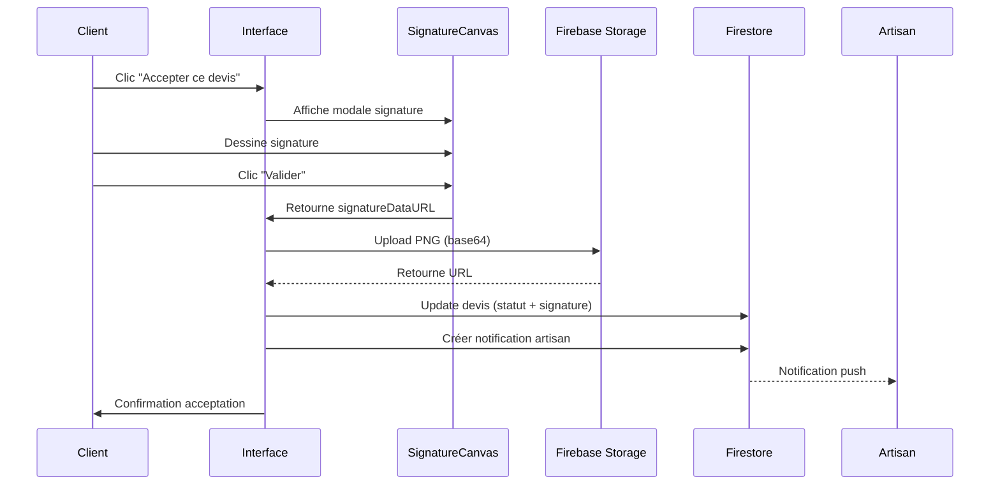

# Signature Électronique pour l'Acceptation de Devis

## 📋 Vue d'ensemble

Le système de signature électronique permet aux clients de signer numériquement un devis avant son acceptation, garantissant ainsi une valeur juridique équivalente à une signature manuscrite (conformément au règlement eIDAS).

## ✨ Fonctionnalités

### Pour le Client

1. **Processus d'acceptation amélioré**
   - Clic sur le bouton "✅ Accepter ce devis"
   - Affichage d'une modale plein écran avec canvas de signature
   - Signature à la souris ou au tactile
   - Possibilité d'effacer et recommencer
   - Validation de la signature

2. **Modale de signature**
   - Canvas HTML5 responsive (700x300px)
   - Support souris + tactile (mobile/tablette)
   - Boutons :
     - ❌ Annuler : Ferme la modale sans signer
     - 🔄 Effacer : Recommence la signature
     - ✅ Valider : Accepte le devis avec signature

3. **Sauvegarde sécurisée**
   - Signature convertie en image PNG (base64)
   - Upload automatique dans Firebase Storage (`signatures/`)
   - URL stockée dans Firestore avec métadonnées

### Pour l'Artisan

- La signature est visible dans le devis accepté
- Preuve d'engagement contractuel du client
- Traçabilité complète (date, heure, IP optionnelle)

## 🔧 Architecture Technique

### 1. Composant `SignatureCanvas`

**Fichier** : `frontend/src/components/SignatureCanvas.tsx`

```typescript
interface SignatureCanvasProps {
  onSave: (signatureDataURL: string) => void;  // Callback avec signature en base64
  onCancel: () => void;                         // Callback d'annulation
}
```

**Fonctionnalités** :
- Canvas HTML5 avec contexte 2D
- Gestion événements souris (mouseDown, mouseMove, mouseUp)
- Gestion événements tactiles (touchStart, touchMove, touchEnd)
- Conversion canvas → image PNG base64
- Validation (signature obligatoire avant validation)

### 2. Modification Page Devis Client

**Fichier** : `frontend/src/app/client/devis/[id]/page.tsx`

**Changements** :

1. **Imports** :
```typescript
import { ref, uploadString, getDownloadURL } from 'firebase/storage';
import { SignatureCanvas } from '@/components/SignatureCanvas';
```

2. **États** :
```typescript
const [showSignatureModal, setShowSignatureModal] = useState(false);
```

3. **Fonction `handleAccepter`** :
```typescript
// Ancienne version : acceptait directement avec confirm()
// Nouvelle version : ouvre la modale de signature
const handleAccepter = async () => {
  setShowSignatureModal(true);
};
```

4. **Nouvelle fonction `handleSignatureValidated`** :
```typescript
const handleSignatureValidated = async (signatureDataURL: string) => {
  // 1. Upload signature dans Firebase Storage
  const signatureRef = ref(storage, `signatures/${devisId}_${Date.now()}.png`);
  await uploadString(signatureRef, signatureDataURL, 'data_url');
  const signatureURL = await getDownloadURL(signatureRef);

  // 2. Update devis avec signature
  await updateDoc(doc(db, 'devis', devisId), {
    statut: 'accepte',
    dateAcceptation: Timestamp.now(),
    signatureClient: {
      url: signatureURL,
      date: Timestamp.now(),
      ip: '', // Optionnel
    },
  });

  // 3. Notifier artisan
  await notifyArtisanDevisAccepte(...);
};
```

### 3. Type Devis Mis à Jour

**Fichier** : `frontend/src/types/devis.ts`

```typescript
export interface Devis {
  // ... autres champs
  
  // Signature électronique (lors de l'acceptation)
  signatureClient?: {
    url: string;       // URL Firebase Storage
    date: Timestamp;   // Date de signature
    ip?: string;       // IP client (optionnel)
  };
}
```

### 4. Firebase Storage

**Structure** :
```
storage/
└── signatures/
    ├── abc123_1738454321000.png
    ├── def456_1738454322000.png
    └── ...
```

**Règles de sécurité** (à ajouter dans `storage.rules`) :
```
rules_version = '2';
service firebase.storage {
  match /b/{bucket}/o {
    match /signatures/{signatureId} {
      // Seuls clients authentifiés peuvent uploader
      allow create: if request.auth != null 
                    && request.auth.token.role == 'client'
                    && request.resource.size < 5 * 1024 * 1024; // Max 5MB
      
      // Lecture : client propriétaire + artisan lié au devis
      allow read: if request.auth != null;
    }
  }
}
```

## 📝 Workflow Complet



## ⚖️ Valeur Juridique

### Règlement eIDAS (UE n°910/2014)

**Article 25** : *"Une signature électronique ne peut se voir dénier des effets juridiques et ne peut être écartée comme moyen de preuve dans le cadre d'une procédure judiciaire au seul motif qu'elle se présente sous une forme électronique ou qu'elle ne satisfait pas aux exigences de la signature électronique qualifiée."*

### Preuves Stockées

1. **Signature visuelle** : Image PNG du tracé
2. **Horodatage** : Timestamp Firebase (UTC)
3. **Identification** : UID Firebase Auth du client
4. **Document signé** : Snapshot complet du devis dans Firestore
5. **IP (optionnel)** : Adresse IP du client au moment de la signature

### Niveau de Signature

- **Actuel** : Signature Électronique Simple (SES)
- **Futur (Phase 2)** : Signature Électronique Avancée (SEA) avec certificat qualifié

## 🔐 Sécurité

### Protection Fraude

1. **Authentification obligatoire** : Seuls clients connectés peuvent signer
2. **UID Firebase** : Lien signature ↔ compte client
3. **Horodatage serveur** : Impossible de falsifier la date
4. **Storage sécurisé** : Règles Firebase empêchent modification/suppression
5. **Firestore immutable** : Historique des changements de statut

### Traçabilité

```typescript
historiqueStatuts: [
  {
    statut: 'brouillon',
    date: Timestamp("2026-02-01T10:00:00Z"),
  },
  {
    statut: 'envoye',
    date: Timestamp("2026-02-01T10:30:00Z"),
  },
  {
    statut: 'accepte',
    date: Timestamp("2026-02-01T14:15:00Z"),
    commentaire: 'Accepté avec signature électronique',
  },
]
```

## 🎨 UX/UI

### Design

- **Couleurs** :
  - Header : `bg-[#2C3E50]` (bleu foncé)
  - Bouton principal : `bg-[#FF6B00]` (orange)
  - Bouton secondaire : `bg-orange-500`
  - Bouton annulation : `bg-gray-300`

- **Canvas** :
  - Bordure : `border-dashed` gris
  - Fond : Blanc (#FFFFFF)
  - Ligne : Noir (#000000), épaisseur 2px
  - Curseur : `cursor-crosshair`

- **Responsive** :
  - Desktop : Canvas 700x300px
  - Mobile : Canvas adaptatif `w-full`

### Messages Utilisateur

- **Instructions claires** : "Utilisez votre souris ou votre doigt..."
- **Validation** : Alert si signature vide
- **Confirmation** : "✅ Devis accepté avec succès ! Votre signature électronique a été enregistrée."
- **Erreur** : "❌ Erreur lors de l'acceptation. Veuillez réessayer."

## 🧪 Tests

### Scénarios à Tester

1. **Happy Path** :
   - Client signe avec souris → Upload réussi → Devis accepté
   - Client signe au tactile (mobile) → Upload réussi

2. **Validation** :
   - Clic "Valider" sans signature → Alerte "Veuillez signer"
   - Clic "Annuler" → Fermeture modale sans modification

3. **Erreurs** :
   - Erreur upload Storage → Modale reste ouverte
   - Erreur update Firestore → Message d'erreur + retry

4. **Responsiveness** :
   - Desktop (1920x1080) : Canvas visible
   - Tablette (768x1024) : Canvas adaptatif
   - Mobile (375x667) : Signature tactile fluide

### Commandes Test

```bash
# Démarrer frontend
cd frontend && npm run dev

# Naviguer vers devis client
http://localhost:3000/client/devis/[id]

# Tester signature :
1. Clic "Accepter ce devis"
2. Dessiner signature dans canvas
3. Vérifier bouton "Effacer" fonctionne
4. Valider signature
5. Vérifier Firestore : devis.signatureClient.url
6. Vérifier Storage : signatures/[id]_[timestamp].png
```

## 📊 Métriques

### Firebase Quotas

- **Storage** : ~50KB par signature (PNG optimisé)
- **Bandwidth** : Download signatures par artisans
- **Firestore Writes** : 1 write par acceptation (update devis)

### Performance

- **Upload signature** : ~500ms (réseau moyen)
- **Affichage modale** : Instantané
- **Dessin canvas** : 60 FPS (fluide)

## 🚀 Améliorations Futures (Phase 2)

### 1. Signature Électronique Avancée (SEA)

- Intégration certificat qualifié (ex: Universign, DocuSign)
- Vérification identité renforcée (SMS OTP + pièce d'identité)
- Cachet serveur horodaté certifié

### 2. Paraphes Multiples

- Paraphe sur chaque page du devis (si > 1 page)
- Signature finale sur dernière page

### 3. Signature Artisan

- Artisan signe aussi le devis (double signature)
- Contrat bilatéral complet

### 4. Export PDF avec Signature

- Générer PDF du devis avec signature visible
- Envoi automatique par email aux deux parties

### 5. Audit Trail Complet

- Log toutes interactions (ouverture modale, effacements, tentatives)
- Export rapport audit pour litiges

## 📚 Références

- **Règlement eIDAS** : https://eur-lex.europa.eu/legal-content/FR/TXT/?uri=CELEX:32014R0910
- **ANSSI Signature Électronique** : https://www.ssi.gouv.fr/entreprise/reglementation/signature-electronique/
- **Canvas API** : https://developer.mozilla.org/fr/docs/Web/API/Canvas_API

---

**Date de mise en œuvre** : 2026-02-01  
**Version** : 1.0  
**Auteur** : ArtisanSafe Development Team
