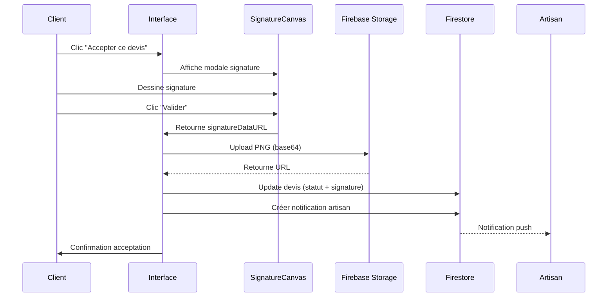

# Signature Électronique + Paiement pour l'Acceptation de Devis

## 📋 Vue d'ensemble

Le système de **signature électronique + paiement obligatoire** garantit un engagement contractuel complet du client. Le workflow complet est :

1. **Signature électronique** (valeur juridique eIDAS)
2. **Paiement dans les 24h** (engagement financier)
3. **Démasquage coordonnées** (accès complet aux données)

⚠️ **IMPORTANT** : Si le client ne paie pas dans les 24h, le devis est **automatiquement annulé** (comme un refus).

## ✨ Fonctionnalités

### Pour le Client

#### 1. Signature Électronique

**Processus** :
- Clic sur "✅ Accepter ce devis"
- Modale plein écran avec canvas de signature
- Signature à la souris ou au tactile
- Possibilité d'effacer et recommencer
- Validation de la signature

**Canvas de signature** :
- Taille : 700x300px responsive
- Support : Souris + tactile (mobile/tablette)
- Boutons :
  - ❌ Annuler : Ferme sans signer
  - 🔄 Effacer : Recommence
  - ✅ Valider : Passe au paiement

#### 2. Paiement Obligatoire (24h)

**Après signature** :
- Modale de paiement s'ouvre automatiquement
- Formulaire carte bancaire (numéro, nom, expiration, CVV)
- **Compte à rebours 24h** affiché en temps réel
- ⚠️ Alerte si < 2h restantes

**Délai 24h** :
- Stocké dans `devis.dateLimitePaiement`
- Calcul : `now + 24 heures`
- Si dépassé → **Annulation automatique** (Cloud Function)

**Formulaire paiement** :
- Auto-formatage : XXXX XXXX XXXX XXXX
- Validation : Luhn algorithm (carte), expiration, CVV
- Simulation : 2s de traitement (TODO: Stripe Phase 2)

#### 3. Démasquage Coordonnées

**Avant paiement** (`statut: 'envoye'` ou `'en_attente_paiement'`) :
- Email : `j***@gmail.com`
- Téléphone : `06 ** ** ** 89`
- Adresse : `32 rue *********, 75001 Paris`

**Après paiement** (`statut: 'paye'`) :
- Email : `john@gmail.com` ✅
- Téléphone : `06 12 34 56 89` ✅
- Adresse : `32 rue Jean Jaurès, 75001 Paris` ✅

### Pour l'Artisan

- **Signature visible** dans le devis (preuve d'engagement)
- **Notification paiement** quand client paie
- **Notification annulation** si client ne paie pas (24h)
- **Coordonnées complètes** visibles après paiement

## 🔧 Architecture Technique

### 1. Composant `SignatureCanvas`

**Fichier** : `frontend/src/components/SignatureCanvas.tsx`

```typescript
interface SignatureCanvasProps {
  onSave: (signatureDataURL: string) => void;  // Callback avec signature en base64
  onCancel: () => void;                         // Callback d'annulation
}
```

**Fonctionnalités** :
- Canvas HTML5 avec contexte 2D
- Gestion événements souris (mouseDown, mouseMove, mouseUp)
- Gestion événements tactiles (touchStart, touchMove, touchEnd)
- Conversion canvas → image PNG base64
- Validation (signature obligatoire avant validation)

### 2. Composant `PaymentForm`

**Fichier** : `frontend/src/components/PaymentForm.tsx`

```typescript
interface PaymentFormProps {
  montant: number;
  devisId: string;
  dateLimitePaiement: Timestamp;
  onSuccess: (paymentData: PaymentData) => void;
  onCancel: () => void;
}
```

**Fonctionnalités** :
- Formulaire carte bancaire avec validation complète
- Auto-formatage : XXXX XXXX XXXX XXXX (espaces automatiques)
- Validation Luhn algorithm (numéro carte)
- Validation expiration (MM/YY, pas dans le passé)
- Validation CVV (3-4 chiffres selon type carte)
- **Compte à rebours 24h** (affichage heures/minutes restantes)
- ⚠️ Alerte rouge si < 2h restantes
- Simulation paiement : 2s de traitement (TODO: Stripe Phase 2)

### 3. Workflow Complet Page Devis Client

**Fichier** : `frontend/src/app/client/devis/[id]/page.tsx`

#### États gérés :
```typescript
const [showSignatureModal, setShowSignatureModal] = useState(false);
const [showPaymentModal, setShowPaymentModal] = useState(false);
const [showRefusalModal, setShowRefusalModal] = useState(false);
```

#### Fonction 1 : `handleAccepter`
```typescript
const handleAccepter = async () => {
  // Ouvre modale de signature
  setShowSignatureModal(true);
};
```

#### Fonction 2 : `handleSignatureValidated`
```typescript
const handleSignatureValidated = async (signatureDataURL: string) => {
  // 1. Upload signature dans Firebase Storage
  const signatureRef = ref(storage, `signatures/${devisId}_${Date.now()}.png`);
  await uploadString(signatureRef, signatureDataURL, 'data_url');
  const signatureURL = await getDownloadURL(signatureRef);

  // 2. Calculer deadline paiement (+24h)
  const now = Date.now();
  const deadline = new Date(now + 24 * 60 * 60 * 1000);

  // 3. Update devis : statut → 'en_attente_paiement'
  await updateDoc(doc(db, 'devis', devisId), {
    statut: 'en_attente_paiement',  // ← Nouveau statut
    dateAcceptation: Timestamp.now(),
    dateLimitePaiement: Timestamp.fromDate(deadline),  // ← Deadline 24h
    signatureClient: {
      url: signatureURL,
      date: Timestamp.now(),
      ip: '',
    },
  });

  // 4. Recharger devis et ouvrir paiement
  setShowSignatureModal(false);
  setShowPaymentModal(true);
};
```

#### Fonction 3 : `handlePaymentSuccess`
```typescript
const handlePaymentSuccess = async (paymentData: PaymentData) => {
  // 1. Update devis : statut → 'paye'
  await updateDoc(doc(db, 'devis', devisId), {
    statut: 'paye',  // ← Statut final
    datePaiement: Timestamp.now(),
    paiement: {
      montant: paymentData.montant,
      date: Timestamp.now(),
      methode: 'carte_bancaire',
      referenceTransaction: paymentData.referenceTransaction,
      statut: 'confirme',
    },
  });

  // 2. Notifier artisan
  await createNotification({
    recipientId: devis.artisanId,
    type: 'devis_paye',
    title: 'Devis payé !',
    message: `Le client a payé le devis ${devis.numeroDevis}`,
  });

  // 3. Recharger pour afficher données démasquées
  window.location.reload();
};
```

#### Fonction masking :
```typescript
function masquerEmail(email: string, shouldMask: boolean = true): string {
  if (!shouldMask) return email;  // ← Démasque si payé
  const [local, domain] = email.split('@');
  return `${local[0]}${'*'.repeat(local.length - 1)}@${domain}`;
}

function masquerTelephoneComplet(telephone: string, shouldMask: boolean = true): string {
  if (!shouldMask) return telephone;  // ← Démasque si payé
  const cleaned = telephone.replace(/\s/g, '');
  return `${cleaned.slice(0, 2)} ** ** ** ${cleaned.slice(-2)}`;
}

function masquerAdresse(adresse: string, shouldMask: boolean = true): string {
  if (!shouldMask) return adresse;  // ← Démasque si payé
  const [numero, ...rest] = adresse.split(' ');
  return `${numero} ${'*'.repeat(15)}, ${rest.slice(-2).join(' ')}`;
}

// Usage dans l'affichage
const shouldMask = devis.statut !== 'paye';  // ← Clé du système
```

### 4. Type Devis Mis à Jour

**Fichier** : `frontend/src/types/devis.ts`

```typescript
export type DevisStatut = 
  | 'brouillon'               // Devis en cours de création
  | 'envoye'                  // Envoyé au client (coordonnées masquées)
  | 'en_attente_paiement'     // Signé, en attente paiement 24h
  | 'paye'                    // Payé (coordonnées démasquées)
  | 'refuse'                  // Refusé par client
  | 'annule';                 // Annulé (timeout paiement ou autre)

export interface Devis {
  // ... autres champs
  statut: DevisStatut;
  
  // Signature électronique (lors de l'acceptation)
  signatureClient?: {
    url: string;              // URL Firebase Storage
    date: Timestamp;          // Date/heure signature
    ip?: string;              // IP client (optionnel)
  };
  
  // Paiement (après signature)
  dateLimitePaiement?: Timestamp;  // Deadline 24h (now + 24h)
  datePaiement?: Timestamp;        // Date paiement effectif
  paiement?: {
    montant: number;               // Montant TTC payé
    date: Timestamp;               // Date transaction
    methode: 'carte_bancaire';     // Méthode paiement
    referenceTransaction: string;  // ID transaction (Stripe)
    statut: 'confirme' | 'en_attente' | 'echoue';
  };
  
  // Annulation (si timeout paiement)
  dateAnnulation?: Timestamp;
  motifAnnulation?: string;  // Ex: "Paiement non effectué dans les 24h"
}
```

### 5. Cloud Function - Annulation Automatique

**Fichier** : `functions/src/scheduledJobs/annulerDevisNonPayes.ts`

```typescript
/**
 * S'exécute toutes les heures
 * Annule devis non payés après 24h
 */
export const annulerDevisNonPayes = functions.pubsub
  .schedule('every 1 hours')
  .timeZone('Europe/Paris')
  .onRun(async () => {
    const db = admin.firestore();
    const now = Timestamp.now();

    // Requête: devis en attente avec deadline dépassée
    const snapshot = await db
      .collection('devis')
      .where('statut', '==', 'en_attente_paiement')
      .where('dateLimitePaiement', '<', now)
      .get();

    if (snapshot.empty) return null;

    const batch = db.batch();

    snapshot.forEach((doc) => {
      const devis = doc.data();

      // Annuler le devis
      batch.update(doc.ref, {
        statut: 'annule',
        dateAnnulation: now,
        motifAnnulation: 'Paiement non effectué dans les 24h après signature',
      });

      // Notifier artisan (comme refus)
      batch.set(db.collection('notifications').doc(), {
        recipientId: devis.artisanId,
        type: 'devis_annule_non_paye',
        title: `Devis ${devis.numeroDevis} annulé`,
        message: `Le client n'a pas payé dans les 24h.`,
        relatedId: doc.id,
        lue: false,
        dateCreation: now,
      });
    });

    await batch.commit();
    return { devisAnnules: snapshot.size };
  });
```

**Déploiement** :
```bash
cd functions
npm install
npm run build
firebase deploy --only functions:annulerDevisNonPayes
```

### 6. Firebase Storage

**Structure** :
```
storage/
└── signatures/
    ├── abc123_1738454321000.png
    ├── def456_1738454322000.png
    └── ...
```

**Règles de sécurité** (à ajouter dans `storage.rules`) :
```
rules_version = '2';
service firebase.storage {
  match /b/{bucket}/o {
    match /signatures/{signatureId} {
      // Seuls clients authentifiés peuvent uploader
      allow create: if request.auth != null 
                    && request.auth.token.role == 'client'
                    && request.resource.size < 5 * 1024 * 1024; // Max 5MB
      
      // Lecture : client propriétaire + artisan lié au devis
      allow read: if request.auth != null;
    }
  }
}
```

## 📝 Workflow Complet



## ⚖️ Valeur Juridique

### Règlement eIDAS (UE n°910/2014)

**Article 25** : *"Une signature électronique ne peut se voir dénier des effets juridiques et ne peut être écartée comme moyen de preuve dans le cadre d'une procédure judiciaire au seul motif qu'elle se présente sous une forme électronique ou qu'elle ne satisfait pas aux exigences de la signature électronique qualifiée."*

### Preuves Stockées

1. **Signature visuelle** : Image PNG du tracé
2. **Horodatage** : Timestamp Firebase (UTC)
3. **Identification** : UID Firebase Auth du client
4. **Document signé** : Snapshot complet du devis dans Firestore
5. **IP (optionnel)** : Adresse IP du client au moment de la signature

### Niveau de Signature

- **Actuel** : Signature Électronique Simple (SES)
- **Futur (Phase 2)** : Signature Électronique Avancée (SEA) avec certificat qualifié

## 🔐 Sécurité

### Protection Fraude

1. **Authentification obligatoire** : Seuls clients connectés peuvent signer
2. **UID Firebase** : Lien signature ↔ compte client
3. **Horodatage serveur** : Impossible de falsifier la date
4. **Storage sécurisé** : Règles Firebase empêchent modification/suppression
5. **Firestore immutable** : Historique des changements de statut

### Traçabilité

```typescript
historiqueStatuts: [
  {
    statut: 'brouillon',
    date: Timestamp("2026-02-01T10:00:00Z"),
  },
  {
    statut: 'envoye',
    date: Timestamp("2026-02-01T10:30:00Z"),
  },
  {
    statut: 'accepte',
    date: Timestamp("2026-02-01T14:15:00Z"),
    commentaire: 'Accepté avec signature électronique',
  },
]
```

## 🎨 UX/UI

### Design

- **Couleurs** :
  - Header : `bg-[#2C3E50]` (bleu foncé)
  - Bouton principal : `bg-[#FF6B00]` (orange)
  - Bouton secondaire : `bg-orange-500`
  - Bouton annulation : `bg-gray-300`

- **Canvas** :
  - Bordure : `border-dashed` gris
  - Fond : Blanc (#FFFFFF)
  - Ligne : Noir (#000000), épaisseur 2px
  - Curseur : `cursor-crosshair`

- **Responsive** :
  - Desktop : Canvas 700x300px
  - Mobile : Canvas adaptatif `w-full`

### Messages Utilisateur

- **Instructions claires** : "Utilisez votre souris ou votre doigt..."
- **Validation** : Alert si signature vide
- **Confirmation** : "✅ Devis accepté avec succès ! Votre signature électronique a été enregistrée."
- **Erreur** : "❌ Erreur lors de l'acceptation. Veuillez réessayer."

## 🧪 Tests

### Scénarios à Tester

1. **Happy Path** :
   - Client signe avec souris → Upload réussi → Devis accepté
   - Client signe au tactile (mobile) → Upload réussi

2. **Validation** :
   - Clic "Valider" sans signature → Alerte "Veuillez signer"
   - Clic "Annuler" → Fermeture modale sans modification

3. **Erreurs** :
   - Erreur upload Storage → Modale reste ouverte
   - Erreur update Firestore → Message d'erreur + retry

4. **Responsiveness** :
   - Desktop (1920x1080) : Canvas visible
   - Tablette (768x1024) : Canvas adaptatif
   - Mobile (375x667) : Signature tactile fluide

### Commandes Test

```bash
# Démarrer frontend
cd frontend && npm run dev

# Naviguer vers devis client
http://localhost:3000/client/devis/[id]

# Tester signature :
1. Clic "Accepter ce devis"
2. Dessiner signature dans canvas
3. Vérifier bouton "Effacer" fonctionne
4. Valider signature
5. Vérifier Firestore : devis.signatureClient.url
6. Vérifier Storage : signatures/[id]_[timestamp].png
```

## 📊 Métriques

### Firebase Quotas

- **Storage** : ~50KB par signature (PNG optimisé)
- **Bandwidth** : Download signatures par artisans
- **Firestore Writes** : 1 write par acceptation (update devis)

### Performance

- **Upload signature** : ~500ms (réseau moyen)
- **Affichage modale** : Instantané
- **Dessin canvas** : 60 FPS (fluide)

## 🚀 Améliorations Futures (Phase 2)

### 1. Signature Électronique Avancée (SEA)

- Intégration certificat qualifié (ex: Universign, DocuSign)
- Vérification identité renforcée (SMS OTP + pièce d'identité)
- Cachet serveur horodaté certifié

### 2. Paraphes Multiples

- Paraphe sur chaque page du devis (si > 1 page)
- Signature finale sur dernière page

### 3. Signature Artisan

- Artisan signe aussi le devis (double signature)
- Contrat bilatéral complet

### 4. Export PDF avec Signature

- Générer PDF du devis avec signature visible
- Envoi automatique par email aux deux parties

### 5. Audit Trail Complet

- Log toutes interactions (ouverture modale, effacements, tentatives)
- Export rapport audit pour litiges

## 📚 Références

- **Règlement eIDAS** : https://eur-lex.europa.eu/legal-content/FR/TXT/?uri=CELEX:32014R0910
- **ANSSI Signature Électronique** : https://www.ssi.gouv.fr/entreprise/reglementation/signature-electronique/
- **Canvas API** : https://developer.mozilla.org/fr/docs/Web/API/Canvas_API

---

**Date de mise en œuvre** : 2026-02-01  
**Version** : 1.0  
**Auteur** : ArtisanSafe Development Team
