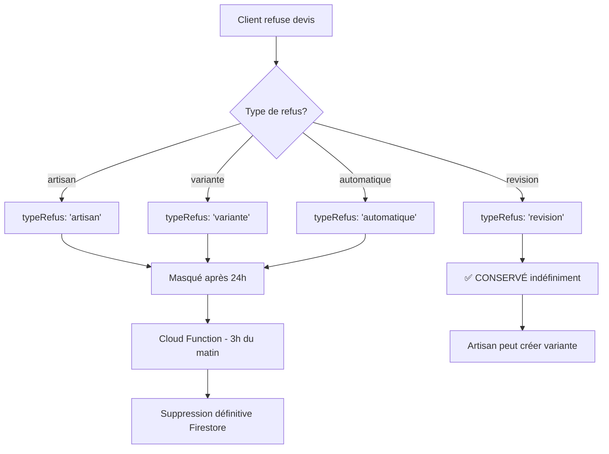

# Suppression automatique des devis refusés

## 📋 Vue d'ensemble

Ce système supprime **définitivement** de Firestore les devis refusés après 24 heures, **SAUF** les demandes de révision.

## 🎯 Types de refus

### ✅ Conservés indéfiniment
- **`typeRefus: 'revision'`** : Le client demande une modification
  - L'artisan peut créer une nouvelle variante
  - Le devis reste visible pour permettre la communication

### 🗑️ Supprimés après 24h
- **`typeRefus: 'artisan'`** : Client bloque cet artisan définitivement
- **`typeRefus: 'variante'`** : Client refuse cette option spécifique
- **`typeRefus: 'automatique'`** : Devis auto-refusé (demande déjà attribuée)
- **`typeRefus: 'definitif'`** : Refus définitif

## 🔧 Solutions disponibles

### 1️⃣ Cloud Function automatique (RECOMMANDÉ)

**Fichier** : `functions/src/cleanupRefusedDevis.ts`

**Exécution** : Tous les jours à 3h du matin (Europe/Paris)

**Déploiement** :
```bash
cd functions
npm install
firebase deploy --only functions:cleanupRefusedDevis
```

**Avantages** :
- ✅ Totalement automatique (pas d'intervention manuelle)
- ✅ Exécution garantie même si personne ne consulte l'app
- ✅ Logs centralisés dans Firebase Console
- ✅ Gratuit jusqu'à 2 millions d'invocations/mois

**Vérifier les logs** :
```bash
firebase functions:log --only cleanupRefusedDevis
```

---

### 2️⃣ Script manuel (Test immédiat)

**Fichier** : `backend/scripts/cleanup-devis-refuses.js`

**Utilisation** :
```bash
cd backend/scripts
node cleanup-devis-refuses.js
```

**Fonctionnalités** :
- Analyse détaillée de chaque devis
- Affiche l'âge du refus en heures
- Demande confirmation avant suppression
- Logs détaillés pour chaque opération

**Exemple de sortie** :
```
🧹 Démarrage nettoyage devis refusés...
════════════════════════════════════════════════════════════
📅 Date limite : 02/02/2026 à 10:30:00
📅 Maintenant : 03/02/2026 à 10:30:00
════════════════════════════════════════════════════════════

📊 5 devis avec statut 'refuse' trouvés

📋 Devis: DEV-2026-001 (abc123)
   Type refus: variante
   Date refus: 01/02/2026 à 15:00:00
   ⏱️  Âge : 43.5h
   🗑️  SERA SUPPRIMÉ : variante refusé depuis 43.5h

📋 Devis: DEV-2026-002 (def456)
   Type refus: revision
   Date refus: 02/02/2026 à 20:00:00
   ⏱️  Âge : 14.5h
   ✅ CONSERVÉ : Révision (artisan peut répondre)

════════════════════════════════════════════════════════════
📊 RÉSUMÉ
════════════════════════════════════════════════════════════
Total analysé : 5
🗑️  À supprimer : 2 (artisan/variante/automatique/definitif > 24h)
🔄 Révisions conservées : 2
⏰ Trop récents : 1 (< 24h)
════════════════════════════════════════════════════════════

⚠️  ATTENTION : Cette action est IRRÉVERSIBLE !

Vous allez supprimer définitivement 2 devis de Firestore.

Confirmer la suppression ? (oui/non) : oui

🗑️  Suppression en cours...
   🗑️  abc123
   🗑️  ghi789

✅ Batch final de 2 devis supprimés

════════════════════════════════════════════════════════════
✅ NETTOYAGE TERMINÉ
════════════════════════════════════════════════════════════
🗑️  2 devis supprimés définitivement
🔄 2 révisions conservées
════════════════════════════════════════════════════════════
```

---

### 3️⃣ Test manuel via HTTP (Cloud Function déployée)

**URL** : `https://europe-west1-[PROJECT_ID].cloudfunctions.net/cleanupRefusedDevisManual`

**Méthode** : POST (aucun paramètre requis)

**Exemple avec curl** :
```bash
curl -X POST https://europe-west1-artisandispo-xyz.cloudfunctions.net/cleanupRefusedDevisManual
```

**Réponse JSON** :
```json
{
  "success": true,
  "devisSupprimes": 3,
  "devisConserves": 2,
  "ids": ["abc123", "def456", "ghi789"],
  "message": "✅ 3 devis supprimés, 2 révisions conservées"
}
```

---

## 🔄 Workflow complet



## 📊 Données supprimées

Quand un devis est supprimé, les données suivantes sont perdues **définitivement** :

### ✅ Conservé ailleurs
- **Notifications** : Restent dans `notifications` collection (historique)
- **Demande** : Reste dans `demandes` collection avec artisansBloqués

### ❌ Supprimé définitivement
- Document complet dans collection `devis`
- Prestations détaillées
- Signature client (si existante)
- Données de paiement (si existantes)
- Métadonnées (dateCreation, dateRefus, motifRefus, etc.)

## ⚙️ Configuration

### Modifier la fréquence de nettoyage

**Fichier** : `functions/src/cleanupRefusedDevis.ts`

```typescript
// Actuel : Tous les jours à 3h
.schedule('0 3 * * *')

// Toutes les 6 heures
.schedule('0 */6 * * *')

// Tous les lundis à minuit
.schedule('0 0 * * 1')
```

**Format cron** : `minute heure jour mois jour_semaine`

### Modifier le délai de suppression

**Actuel** : 24 heures

```typescript
// Changer à 48 heures
const vingtQuatreHeuresEnMillis = 48 * 60 * 60 * 1000;

// Changer à 7 jours
const vingtQuatreHeuresEnMillis = 7 * 24 * 60 * 60 * 1000;
```

---

## 🧪 Tests

### Test 1 : Créer un devis test refusé

```javascript
// Dans Firebase Console > Firestore
{
  statut: 'refuse',
  typeRefus: 'variante',
  dateRefus: Timestamp.fromDate(new Date('2026-02-01')), // > 24h
  clientId: 'xxx',
  artisanId: 'yyy',
  // ... autres champs
}
```

### Test 2 : Exécuter le script manuel

```bash
cd backend/scripts
node cleanup-devis-refuses.js
```

### Test 3 : Vérifier la suppression

```bash
# Firebase Console > Firestore > devis
# Vérifier que le document n'existe plus
```

---

## 🚨 Sécurité & Conformité

### RGPD
✅ **Conforme** : Les données sont supprimées après un délai raisonnable (24h)

### Soft Delete vs Hard Delete
- ❌ **Pas de soft delete** pour ces devis (suppression définitive)
- ✅ **Justification** : Devis refusés = aucune valeur business après 24h
- ✅ **Exception** : Révisions conservées pour permettre la réponse artisan

### Audit Trail
- ✅ Notifications conservées (historique des refus)
- ✅ Logs Cloud Functions (traçabilité suppressions)
- ✅ Demande conserve liste artisansBloqués

---

## 📝 Checklist déploiement

- [ ] Installer dépendances : `cd functions && npm install`
- [ ] Compiler TypeScript : `npm run build`
- [ ] Déployer fonction : `firebase deploy --only functions:cleanupRefusedDevis`
- [ ] Vérifier déploiement : `firebase functions:log`
- [ ] Tester manuellement : Appeler endpoint HTTP `/cleanupRefusedDevisManual`
- [ ] Attendre exécution automatique (3h du matin)
- [ ] Vérifier logs : `firebase functions:log --only cleanupRefusedDevis`

---

## 🔗 Fichiers liés

- `functions/src/cleanupRefusedDevis.ts` : Cloud Function scheduled
- `backend/scripts/cleanup-devis-refuses.js` : Script manuel Node.js
- `frontend/src/app/artisan/devis/page.tsx` : Masquage UI après 24h (ligne 134-145)
- `frontend/src/app/client/devis/[id]/page.tsx` : Logique refus devis (ligne 316-480)

---

## 💡 FAQ

**Q : Pourquoi supprimer définitivement au lieu de soft delete ?**  
R : Les devis refusés n'ont aucune valeur après 24h. La suppression économise l'espace Firestore et simplifie les requêtes.

**Q : Peut-on récupérer un devis supprimé ?**  
R : Non, la suppression est définitive. Les notifications restent dans l'historique.

**Q : Les révisions sont-elles aussi supprimées ?**  
R : Non, les révisions (`typeRefus: 'revision'`) sont **conservées indéfiniment** pour permettre à l'artisan de répondre.

**Q : Que se passe-t-il si la Cloud Function échoue ?**  
R : Elle réessaiera le lendemain. En cas d'échec répété, utiliser le script manuel.

**Q : Combien coûte cette Cloud Function ?**  
R : Gratuit jusqu'à 2M invocations/mois (largement suffisant pour 1 exécution/jour).
