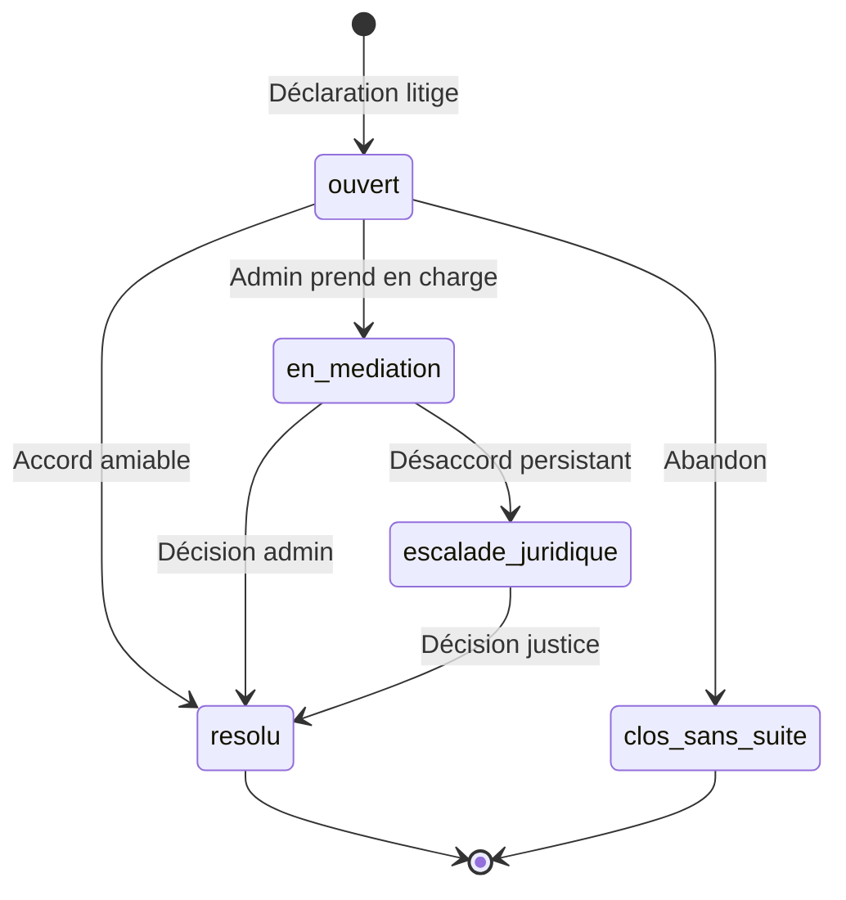

# Système de Gestion des Litiges - ArtisanSafe

> **Système complet** de gestion des litiges entre clients et artisans avec traçabilité, historique des actions, médiation admin et résolution structurée.

## 📋 Vue d'ensemble

### Problème actuel
- ❌ Aucune collection Firestore dédiée aux litiges
- ❌ Données litige stockées dans `devis.litige` (non scalable)
- ❌ Aucun historique des actions
- ❌ Aucune page admin pour médiation
- ❌ Pas de traçabilité des décisions
- ❌ Workflow litige incomplet

### Solution proposée
✅ **Collection Firestore `litiges`** dédiée  
✅ **Timeline d'historique** pour chaque action  
✅ **Statuts de résolution** clairs  
✅ **Pages dédiées** client/artisan/admin  
✅ **Service litige-service.ts** complet  
✅ **Notifications** automatiques à chaque étape  

---

## 🗂️ Structure Firestore

### Collection `litiges`

```typescript
interface Litige {
  id: string;
  
  // Références
  devisId: string;           // Devis concerné
  contratId?: string;        // Contrat si créé
  clientId: string;
  artisanId: string;
  
  // Informations litige
  type: 'non_conformite' | 'retard' | 'abandon_chantier' | 'facture_excessive' | 'autre';
  objet: string;             // Titre court (max 100 chars)
  description: string;        // Description détaillée du problème
  preuves: {
    photos?: string[];        // URLs Firebase Storage
    documents?: string[];     // PDFs, contrats, factures
    messages?: string[];      // IDs messages concernés
  };
  
  // Statut
  statut: 'ouvert' | 'en_mediation' | 'resolu' | 'clos_sans_suite' | 'escalade_juridique';
  priorite: 'basse' | 'moyenne' | 'haute' | 'urgente';
  
  // Parties prenantes
  ouvertPar: 'client' | 'artisan';
  assigneA?: string;          // Admin UID si en médiation
  
  // Résolution
  resolutionType?: 'remboursement_partiel' | 'remboursement_total' | 
                   'travaux_supplementaires' | 'reduction_prix' | 
                   'annulation_contrat' | 'autre';
  resolutionDetails?: string;
  montantCompensation?: number;  // En euros
  dateLimiteResolution?: Timestamp;
  
  // Dates
  createdAt: Timestamp;
  updatedAt: Timestamp;
  resolvedAt?: Timestamp;
  closedAt?: Timestamp;
  
  // Timeline/Historique
  historique: HistoriqueAction[];
  
  // Métadonnées
  versionSchema: number;      // Schema versioning
  tags?: string[];            // Catégorisation (ex: ["paiement", "qualité"])
}

interface HistoriqueAction {
  id: string;                 // UUID unique
  timestamp: Timestamp;
  acteur: string;             // UID (client, artisan, admin)
  acteurRole: 'client' | 'artisan' | 'admin';
  acteurNom: string;          // Nom complet pour affichage
  
  type: 'creation' | 'message' | 'changement_statut' | 
        'ajout_preuve' | 'proposition_resolution' | 
        'acceptation_resolution' | 'refus_resolution' |
        'assignation_admin' | 'escalade' | 'cloture';
  
  description: string;        // Description lisible
  
  // Données spécifiques selon type
  metadata?: {
    ancienStatut?: string;
    nouveauStatut?: string;
    messageId?: string;
    preuveUrl?: string;
    propositionId?: string;
    montant?: number;
  };
}
```

---

## 🔄 Workflow Complet

### 1. Ouverture du litige (Client ou Artisan)

```typescript
// Client déclare litige depuis /client/contrats/[id]
const litige = await ouvrirLitige({
  devisId: 'devis123',
  contratId: 'contrat456',
  ouvertPar: 'client',
  type: 'non_conformite',
  objet: 'Installation non conforme aux normes',
  description: 'Le tableau électrique ne respecte pas la norme NF C 15-100...',
  preuves: {
    photos: ['url1', 'url2']
  }
});

// → Statut: 'ouvert'
// → Notification artisan
// → Email admin (si priorité haute)
// → Historique: action 'creation'
```

### 2. Réponse de l'autre partie

```typescript
// Artisan répond
await ajouterMessageLitige(litige.id, {
  auteurId: artisanId,
  contenu: 'Les travaux respectent la norme, voici le certificat Consuel',
  preuves: ['certificat.pdf']
});

// → Historique: action 'message'
// → Notification client
```

### 3. Tentative de résolution amiable

```typescript
// Artisan propose solution
await proposerResolution(litige.id, {
  type: 'travaux_supplementaires',
  details: 'Je propose de refaire le câblage défectueux sous 5 jours',
  delai: 5,
  cout: 0  // Gratuit
});

// → Statut: reste 'ouvert'
// → Historique: action 'proposition_resolution'
// → Notification client pour acceptation
```

**Client accepte :**
```typescript
await accepterResolution(litige.id, propositionId);

// → Statut: 'resolu'
// → Historique: action 'acceptation_resolution'
// → Notification artisan
// → Contrat mis à jour (nouveau délai)
```

**Client refuse :**
```typescript
await refuserResolution(litige.id, propositionId, 'Délai trop long');

// → Statut: reste 'ouvert'
// → Historique: action 'refus_resolution'
// → Escalade vers admin si 3 refus
```

### 4. Médiation Admin

```typescript
// Admin prend en charge
await assignerAdminLitige(litige.id, adminId);

// → Statut: 'en_mediation'
// → Historique: action 'assignation_admin'
// → Notification client + artisan

// Admin analyse le dossier
await ajouterCommentaireAdmin(litige.id, {
  commentaire: 'Après analyse des photos, non-conformité avérée',
  recommandation: 'remboursement_partiel',
  montant: 500
});

// Admin impose décision
await cloturerLitige(litige.id, {
  type: 'remboursement_partiel',
  details: 'Remboursement 500€ + reprise travaux gratuite',
  montantCompensation: 500
});

// → Statut: 'resolu'
// → Historique: action 'cloture'
// → Notification client + artisan
// → Déclenchement remboursement Stripe
```

### 5. Escalade juridique

```typescript
// Si désaccord après médiation admin
await escaladerLitige(litige.id, {
  motif: 'Désaccord persistant après médiation',
  avocat: 'Cabinet Dupont & Associés'
});

// → Statut: 'escalade_juridique'
// → Historique: action 'escalade'
// → Email admin + parties
// → Gel du séquestre Stripe (conservé jusqu'à décision justice)
```

---

## 📊 Statuts et Transitions



### Règles de transition

| Statut actuel | Peut passer à | Acteurs autorisés |
|--------------|---------------|-------------------|
| `ouvert` | `en_mediation` | Client, Artisan, Admin (automatique après 7 jours) |
| `ouvert` | `resolu` | Client + Artisan (accord) |
| `ouvert` | `clos_sans_suite` | Créateur du litige uniquement |
| `en_mediation` | `resolu` | Admin uniquement |
| `en_mediation` | `escalade_juridique` | Client ou Artisan |
| `escalade_juridique` | `resolu` | Admin (après décision justice) |

---

## 🎨 Interfaces Utilisateur

### Page Client `/client/litiges/[id]`

```tsx
// Sections affichées
1. Résumé litige (type, objet, statut, priorité)
2. Informations contrat (artisan, montant, dates)
3. Timeline historique (actions chronologiques)
4. Messages échangés
5. Propositions de résolution (en attente acceptation)
6. Actions disponibles :
   - Ajouter message
   - Ajouter preuves (photos/documents)
   - Accepter/Refuser proposition
   - Demander médiation admin
   - Clore sans suite (si résolu)
```

### Page Artisan `/artisan/litiges/[id]`

```tsx
// Sections affichées
1. Résumé litige
2. Informations contrat (client, montant)
3. Timeline historique
4. Messages échangés
5. Proposer solution :
   - Type résolution (travaux, remboursement, réduction)
   - Détails proposition
   - Délai
   - Coût additionnel
6. Actions disponibles :
   - Ajouter message/preuves
   - Proposer résolution
   - Accepter résolution client
   - Demander médiation admin
```

### Page Admin `/admin/litiges`

```tsx
// Liste litiges
- Filtres : statut, priorité, date, type
- Tri : date création, priorité, artisan
- Indicateurs :
  - Litiges ouverts
  - En médiation
  - Temps moyen résolution
  - Taux résolution amiable

// Page détail `/admin/litiges/[id]`
1. Résumé complet (toutes infos)
2. Timeline historique détaillée
3. Analyse :
   - Historique artisan (autres litiges)
   - Historique client (réclamations)
   - Montants en jeu
4. Actions admin :
   - Assigner à admin
   - Ajouter commentaire interne
   - Proposer résolution
   - Imposer décision
   - Déclencher remboursement
   - Escalader juridique
   - Clôturer litige
```

---

## 🔔 Notifications

### Événements notifiés

| Événement | Destinataires | Titre | Canaux |
|-----------|--------------|-------|--------|
| Nouveau litige | Autre partie + Admin | "Nouveau litige déclaré" | Notification + Email |
| Message litige | Autre partie | "Nouveau message sur litige #XXX" | Notification + Email |
| Proposition résolution | Autre partie | "Proposition de résolution reçue" | Notification + Email |
| Acceptation résolution | Proposant | "Votre proposition acceptée" | Notification + Email |
| Refus résolution | Proposant | "Votre proposition refusée" | Notification + Email |
| Admin assigné | Client + Artisan | "Admin en charge de votre litige" | Notification + Email |
| Décision admin | Client + Artisan | "Décision admin sur litige #XXX" | Notification + Email + SMS |
| Escalade juridique | Client + Artisan + Admin | "Litige escaladé niveau juridique" | Email + SMS |
| Litige résolu | Client + Artisan | "Litige #XXX résolu" | Notification + Email |

---

## 💾 Service Firestore

### Fichier `frontend/src/lib/firebase/litige-service.ts`

```typescript
import {
  collection,
  doc,
  getDoc,
  getDocs,
  addDoc,
  updateDoc,
  query,
  where,
  orderBy,
  Timestamp,
  arrayUnion,
} from 'firebase/firestore';
import { db } from './config';
import type { Litige, HistoriqueAction } from '@/types/litige';
import { createNotification } from './notification-service';
import { v4 as uuidv4 } from 'uuid';

/**
 * Ouvrir un nouveau litige
 */
export async function ouvrirLitige(data: {
  devisId: string;
  contratId?: string;
  clientId: string;
  artisanId: string;
  ouvertPar: 'client' | 'artisan';
  type: Litige['type'];
  objet: string;
  description: string;
  preuves?: Litige['preuves'];
  priorite?: Litige['priorite'];
}): Promise<Litige> {
  const now = Timestamp.now();
  
  // Créer action historique initiale
  const actionCreation: HistoriqueAction = {
    id: uuidv4(),
    timestamp: now,
    acteur: data.ouvertPar === 'client' ? data.clientId : data.artisanId,
    acteurRole: data.ouvertPar,
    acteurNom: await getNomActeur(data.ouvertPar === 'client' ? data.clientId : data.artisanId),
    type: 'creation',
    description: `Litige ouvert par ${data.ouvertPar}`,
    metadata: {
      nouveauStatut: 'ouvert'
    }
  };

  const litige: Omit<Litige, 'id'> = {
    devisId: data.devisId,
    contratId: data.contratId,
    clientId: data.clientId,
    artisanId: data.artisanId,
    type: data.type,
    objet: data.objet,
    description: data.description,
    preuves: data.preuves || {},
    statut: 'ouvert',
    priorite: data.priorite || 'moyenne',
    ouvertPar: data.ouvertPar,
    createdAt: now,
    updatedAt: now,
    historique: [actionCreation],
    versionSchema: 1
  };

  const docRef = await addDoc(collection(db, 'litiges'), litige);
  
  // Notification autre partie
  const destinataireId = data.ouvertPar === 'client' ? data.artisanId : data.clientId;
  await createNotification({
    recipientId: destinataireId,
    type: 'litige_ouvert',
    title: 'Nouveau litige déclaré',
    message: `Un litige a été ouvert concernant votre ${data.ouvertPar === 'client' ? 'prestation' : 'commande'}`,
    relatedId: docRef.id
  });

  // Email admin si priorité haute/urgente
  if (data.priorite === 'haute' || data.priorite === 'urgente') {
    await envoyerEmailAdminNouveauLitige(docRef.id, data);
  }

  return { id: docRef.id, ...litige };
}

/**
 * Ajouter un message au litige
 */
export async function ajouterMessageLitige(
  litigeId: string,
  data: {
    auteurId: string;
    auteurRole: 'client' | 'artisan' | 'admin';
    contenu: string;
    preuves?: string[];
  }
): Promise<void> {
  const litigeRef = doc(db, 'litiges', litigeId);
  const litigeSnap = await getDoc(litigeRef);
  
  if (!litigeSnap.exists()) {
    throw new Error('Litige introuvable');
  }

  const litige = litigeSnap.data() as Litige;
  const now = Timestamp.now();

  const action: HistoriqueAction = {
    id: uuidv4(),
    timestamp: now,
    acteur: data.auteurId,
    acteurRole: data.auteurRole,
    acteurNom: await getNomActeur(data.auteurId),
    type: 'message',
    description: data.contenu.substring(0, 100) + (data.contenu.length > 100 ? '...' : ''),
    metadata: data.preuves ? { preuveUrl: data.preuves[0] } : undefined
  };

  await updateDoc(litigeRef, {
    historique: arrayUnion(action),
    updatedAt: now,
    ...(data.preuves && {
      'preuves.documents': arrayUnion(...data.preuves)
    })
  });

  // Notification autre partie
  const destinataireId = data.auteurRole === 'client' ? litige.artisanId : litige.clientId;
  await createNotification({
    recipientId: destinataireId,
    type: 'message_litige',
    title: 'Nouveau message sur litige',
    message: data.contenu.substring(0, 50) + '...',
    relatedId: litigeId
  });
}

/**
 * Proposer une résolution
 */
export async function proposerResolution(
  litigeId: string,
  data: {
    proposantId: string;
    proposantRole: 'client' | 'artisan' | 'admin';
    type: Litige['resolutionType'];
    details: string;
    montantCompensation?: number;
    delaiJours?: number;
  }
): Promise<string> {
  const litigeRef = doc(db, 'litiges', litigeId);
  const litigeSnap = await getDoc(litigeRef);
  
  if (!litigeSnap.exists()) {
    throw new Error('Litige introuvable');
  }

  const litige = litigeSnap.data() as Litige;
  const now = Timestamp.now();
  const propositionId = uuidv4();

  const action: HistoriqueAction = {
    id: uuidv4(),
    timestamp: now,
    acteur: data.proposantId,
    acteurRole: data.proposantRole,
    acteurNom: await getNomActeur(data.proposantId),
    type: 'proposition_resolution',
    description: `Proposition: ${data.type} - ${data.details}`,
    metadata: {
      propositionId,
      montant: data.montantCompensation
    }
  };

  await updateDoc(litigeRef, {
    historique: arrayUnion(action),
    updatedAt: now
  });

  // Notification autre partie
  const destinataireId = data.proposantRole === 'client' ? litige.artisanId : litige.clientId;
  await createNotification({
    recipientId: destinataireId,
    type: 'proposition_resolution',
    title: 'Proposition de résolution',
    message: data.details.substring(0, 100),
    relatedId: litigeId
  });

  return propositionId;
}

/**
 * Accepter une proposition de résolution
 */
export async function accepterResolution(
  litigeId: string,
  propositionId: string,
  acceptantId: string,
  acceptantRole: 'client' | 'artisan'
): Promise<void> {
  const litigeRef = doc(db, 'litiges', litigeId);
  const litigeSnap = await getDoc(litigeRef);
  
  if (!litigeSnap.exists()) {
    throw new Error('Litige introuvable');
  }

  const litige = litigeSnap.data() as Litige;
  const now = Timestamp.now();

  // Trouver la proposition dans l'historique
  const proposition = litige.historique.find(
    h => h.type === 'proposition_resolution' && h.metadata?.propositionId === propositionId
  );

  if (!proposition) {
    throw new Error('Proposition introuvable');
  }

  const action: HistoriqueAction = {
    id: uuidv4(),
    timestamp: now,
    acteur: acceptantId,
    acteurRole: acceptantRole,
    acteurNom: await getNomActeur(acceptantId),
    type: 'acceptation_resolution',
    description: `Proposition acceptée: ${proposition.description}`,
    metadata: {
      propositionId,
      ancienStatut: litige.statut,
      nouveauStatut: 'resolu'
    }
  };

  await updateDoc(litigeRef, {
    statut: 'resolu',
    resolvedAt: now,
    updatedAt: now,
    historique: arrayUnion(action)
  });

  // Notifications
  const proposantId = proposition.acteur;
  await createNotification({
    recipientId: proposantId,
    type: 'resolution_acceptee',
    title: 'Proposition acceptée',
    message: 'Votre proposition de résolution a été acceptée',
    relatedId: litigeId
  });
}

/**
 * Refuser une proposition de résolution
 */
export async function refuserResolution(
  litigeId: string,
  propositionId: string,
  refusantId: string,
  refusantRole: 'client' | 'artisan',
  motif: string
): Promise<void> {
  const litigeRef = doc(db, 'litiges', litigeId);
  const litigeSnap = await getDoc(litigeRef);
  
  if (!litigeSnap.exists()) {
    throw new Error('Litige introuvable');
  }

  const litige = litigeSnap.data() as Litige;
  const now = Timestamp.now();

  const proposition = litige.historique.find(
    h => h.type === 'proposition_resolution' && h.metadata?.propositionId === propositionId
  );

  if (!proposition) {
    throw new Error('Proposition introuvable');
  }

  const action: HistoriqueAction = {
    id: uuidv4(),
    timestamp: now,
    acteur: refusantId,
    acteurRole: refusantRole,
    acteurNom: await getNomActeur(refusantId),
    type: 'refus_resolution',
    description: `Proposition refusée: ${motif}`,
    metadata: {
      propositionId
    }
  };

  await updateDoc(litigeRef, {
    updatedAt: now,
    historique: arrayUnion(action)
  });

  // Notification proposant
  await createNotification({
    recipientId: proposition.acteur,
    type: 'resolution_refusee',
    title: 'Proposition refusée',
    message: motif,
    relatedId: litigeId
  });

  // Auto-escalade après 3 refus
  const nbRefus = litige.historique.filter(h => h.type === 'refus_resolution').length + 1;
  if (nbRefus >= 3) {
    await assignerAdminLitige(litigeId, 'auto-escalade');
  }
}

/**
 * Assigner un admin au litige (médiation)
 */
export async function assignerAdminLitige(
  litigeId: string,
  adminId: string
): Promise<void> {
  const litigeRef = doc(db, 'litiges', litigeId);
  const litigeSnap = await getDoc(litigeRef);
  
  if (!litigeSnap.exists()) {
    throw new Error('Litige introuvable');
  }

  const litige = litigeSnap.data() as Litige;
  const now = Timestamp.now();

  const action: HistoriqueAction = {
    id: uuidv4(),
    timestamp: now,
    acteur: adminId,
    acteurRole: 'admin',
    acteurNom: adminId === 'auto-escalade' ? 'Système' : await getNomActeur(adminId),
    type: 'assignation_admin',
    description: 'Admin assigné pour médiation',
    metadata: {
      ancienStatut: litige.statut,
      nouveauStatut: 'en_mediation'
    }
  };

  await updateDoc(litigeRef, {
    statut: 'en_mediation',
    assigneA: adminId,
    updatedAt: now,
    historique: arrayUnion(action)
  });

  // Notifications client + artisan
  await createNotification({
    recipientId: litige.clientId,
    type: 'admin_assigne',
    title: 'Admin en charge du litige',
    message: 'Un administrateur a été assigné pour médiation',
    relatedId: litigeId
  });

  await createNotification({
    recipientId: litige.artisanId,
    type: 'admin_assigne',
    title: 'Admin en charge du litige',
    message: 'Un administrateur a été assigné pour médiation',
    relatedId: litigeId
  });
}

/**
 * Clôturer un litige (admin uniquement)
 */
export async function cloturerLitige(
  litigeId: string,
  adminId: string,
  data: {
    type: Litige['resolutionType'];
    details: string;
    montantCompensation?: number;
  }
): Promise<void> {
  const litigeRef = doc(db, 'litiges', litigeId);
  const litigeSnap = await getDoc(litigeRef);
  
  if (!litigeSnap.exists()) {
    throw new Error('Litige introuvable');
  }

  const litige = litigeSnap.data() as Litige;
  const now = Timestamp.now();

  const action: HistoriqueAction = {
    id: uuidv4(),
    timestamp: now,
    acteur: adminId,
    acteurRole: 'admin',
    acteurNom: await getNomActeur(adminId),
    type: 'cloture',
    description: `Décision admin: ${data.type} - ${data.details}`,
    metadata: {
      ancienStatut: litige.statut,
      nouveauStatut: 'resolu',
      montant: data.montantCompensation
    }
  };

  await updateDoc(litigeRef, {
    statut: 'resolu',
    resolutionType: data.type,
    resolutionDetails: data.details,
    montantCompensation: data.montantCompensation,
    resolvedAt: now,
    closedAt: now,
    updatedAt: now,
    historique: arrayUnion(action)
  });

  // Notifications client + artisan
  await createNotification({
    recipientId: litige.clientId,
    type: 'litige_resolu',
    title: 'Litige résolu',
    message: data.details.substring(0, 100),
    relatedId: litigeId
  });

  await createNotification({
    recipientId: litige.artisanId,
    type: 'litige_resolu',
    title: 'Litige résolu',
    message: data.details.substring(0, 100),
    relatedId: litigeId
  });

  // Déclencher remboursement si applicable
  if (data.montantCompensation && data.montantCompensation > 0) {
    await declencherRemboursementStripe(litige.devisId, data.montantCompensation);
  }
}

/**
 * Récupérer litiges par client
 */
export async function getLitigesByClient(clientId: string): Promise<Litige[]> {
  const q = query(
    collection(db, 'litiges'),
    where('clientId', '==', clientId),
    orderBy('createdAt', 'desc')
  );

  const snapshot = await getDocs(q);
  return snapshot.docs.map(doc => ({ id: doc.id, ...doc.data() } as Litige));
}

/**
 * Récupérer litiges par artisan
 */
export async function getLitigesByArtisan(artisanId: string): Promise<Litige[]> {
  const q = query(
    collection(db, 'litiges'),
    where('artisanId', '==', artisanId),
    orderBy('createdAt', 'desc')
  );

  const snapshot = await getDocs(q);
  return snapshot.docs.map(doc => ({ id: doc.id, ...doc.data() } as Litige));
}

/**
 * Récupérer tous litiges (admin)
 */
export async function getAllLitiges(filters?: {
  statut?: Litige['statut'];
  priorite?: Litige['priorite'];
}): Promise<Litige[]> {
  let q = query(collection(db, 'litiges'));

  if (filters?.statut) {
    q = query(q, where('statut', '==', filters.statut));
  }

  if (filters?.priorite) {
    q = query(q, where('priorite', '==', filters.priorite));
  }

  q = query(q, orderBy('createdAt', 'desc'));

  const snapshot = await getDocs(q);
  return snapshot.docs.map(doc => ({ id: doc.id, ...doc.data() } as Litige));
}

/**
 * Récupérer litige par ID
 */
export async function getLitigeById(litigeId: string): Promise<Litige | null> {
  const docSnap = await getDoc(doc(db, 'litiges', litigeId));
  
  if (!docSnap.exists()) {
    return null;
  }

  return { id: docSnap.id, ...docSnap.data() } as Litige;
}

// Helper functions
async function getNomActeur(userId: string): Promise<string> {
  // TODO: Récupérer depuis collection users
  return 'Utilisateur';
}

async function envoyerEmailAdminNouveauLitige(litigeId: string, data: any): Promise<void> {
  // TODO: Implémenter envoi email
  console.log('Email admin litige:', litigeId);
}

async function declencherRemboursementStripe(devisId: string, montant: number): Promise<void> {
  // TODO: Implémenter remboursement Stripe
  console.log('Remboursement Stripe:', devisId, montant);
}
```

---

## 📝 Types TypeScript

### Fichier `frontend/src/types/litige.ts`

```typescript
import type { Timestamp } from 'firebase/firestore';

export type LitigeType = 
  | 'non_conformite'        // Travaux non conformes
  | 'retard'                // Retard dans l'exécution
  | 'abandon_chantier'      // Artisan abandonne
  | 'facture_excessive'     // Montant anormal
  | 'autre';                // Autre motif

export type LitigeStatut = 
  | 'ouvert'                // Déclaré, en cours
  | 'en_mediation'          // Admin intervient
  | 'resolu'                // Résolu (amiable ou admin)
  | 'clos_sans_suite'       // Abandonné
  | 'escalade_juridique';   // Vers tribunal

export type LitigePriorite = 'basse' | 'moyenne' | 'haute' | 'urgente';

export type ResolutionType = 
  | 'remboursement_partiel'
  | 'remboursement_total'
  | 'travaux_supplementaires'
  | 'reduction_prix'
  | 'annulation_contrat'
  | 'autre';

export interface Litige {
  id: string;
  
  // Références
  devisId: string;
  contratId?: string;
  clientId: string;
  artisanId: string;
  
  // Informations litige
  type: LitigeType;
  objet: string;
  description: string;
  preuves: {
    photos?: string[];
    documents?: string[];
    messages?: string[];
  };
  
  // Statut
  statut: LitigeStatut;
  priorite: LitigePriorite;
  
  // Parties prenantes
  ouvertPar: 'client' | 'artisan';
  assigneA?: string;
  
  // Résolution
  resolutionType?: ResolutionType;
  resolutionDetails?: string;
  montantCompensation?: number;
  dateLimiteResolution?: Timestamp;
  
  // Dates
  createdAt: Timestamp;
  updatedAt: Timestamp;
  resolvedAt?: Timestamp;
  closedAt?: Timestamp;
  
  // Timeline
  historique: HistoriqueAction[];
  
  // Métadonnées
  versionSchema: number;
  tags?: string[];
}

export type ActionType = 
  | 'creation'
  | 'message'
  | 'changement_statut'
  | 'ajout_preuve'
  | 'proposition_resolution'
  | 'acceptation_resolution'
  | 'refus_resolution'
  | 'assignation_admin'
  | 'escalade'
  | 'cloture';

export interface HistoriqueAction {
  id: string;
  timestamp: Timestamp;
  acteur: string;
  acteurRole: 'client' | 'artisan' | 'admin';
  acteurNom: string;
  
  type: ActionType;
  description: string;
  
  metadata?: {
    ancienStatut?: string;
    nouveauStatut?: string;
    messageId?: string;
    preuveUrl?: string;
    propositionId?: string;
    montant?: number;
  };
}

export interface LitigeStats {
  total: number;
  ouverts: number;
  enMediation: number;
  resolus: number;
  tauxResolutionAmiable: number;
  tempsResolutionMoyen: number; // En jours
  montantCompensationTotal: number;
}
```

---

## 🔐 Firestore Security Rules

```javascript
// firestore.rules
rules_version = '2';
service cloud.firestore {
  match /databases/{database}/documents {
    
    // Collection litiges
    match /litiges/{litigeId} {
      // Lecture: client, artisan concernés ou admin
      allow read: if request.auth != null && (
        resource.data.clientId == request.auth.uid ||
        resource.data.artisanId == request.auth.uid ||
        isAdmin()
      );
      
      // Création: client ou artisan concerné
      allow create: if request.auth != null && (
        request.resource.data.clientId == request.auth.uid ||
        request.resource.data.artisanId == request.auth.uid
      ) && request.resource.data.statut == 'ouvert';
      
      // Mise à jour: parties concernées ou admin
      allow update: if request.auth != null && (
        resource.data.clientId == request.auth.uid ||
        resource.data.artisanId == request.auth.uid ||
        isAdmin()
      ) && (
        // Seul admin peut passer en 'resolu' ou 'escalade_juridique'
        !request.resource.data.diff(resource.data).affectedKeys().hasAny(['statut']) ||
        (isAdmin() && request.resource.data.statut in ['resolu', 'escalade_juridique']) ||
        (!isAdmin() && request.resource.data.statut in ['ouvert', 'en_mediation', 'clos_sans_suite'])
      );
      
      // Suppression: admin uniquement
      allow delete: if isAdmin();
    }
    
    function isAdmin() {
      return exists(/databases/$(database)/documents/users/$(request.auth.uid)) &&
             get(/databases/$(database)/documents/users/$(request.auth.uid)).data.role == 'admin';
    }
  }
}
```

---

## 📈 Métriques et KPIs

### Indicateurs à suivre

```typescript
export async function getLitigeStats(): Promise<LitigeStats> {
  const litiges = await getAllLitiges();
  
  const ouverts = litiges.filter(l => l.statut === 'ouvert').length;
  const enMediation = litiges.filter(l => l.statut === 'en_mediation').length;
  const resolus = litiges.filter(l => l.statut === 'resolu').length;
  
  // Taux résolution amiable (sans admin)
  const resolusAmiable = litiges.filter(l => 
    l.statut === 'resolu' && 
    !l.historique.some(h => h.type === 'assignation_admin')
  ).length;
  
  const tauxResolutionAmiable = resolus > 0 ? (resolusAmiable / resolus) * 100 : 0;
  
  // Temps moyen résolution
  const resolusAvecDates = litiges.filter(l => l.resolvedAt && l.createdAt);
  const tempsTotal = resolusAvecDates.reduce((sum, l) => {
    const duree = l.resolvedAt!.toMillis() - l.createdAt.toMillis();
    return sum + (duree / (1000 * 60 * 60 * 24)); // Convertir en jours
  }, 0);
  
  const tempsResolutionMoyen = resolusAvecDates.length > 0 
    ? tempsTotal / resolusAvecDates.length 
    : 0;
  
  // Montant compensations
  const montantCompensationTotal = litiges.reduce(
    (sum, l) => sum + (l.montantCompensation || 0), 
    0
  );
  
  return {
    total: litiges.length,
    ouverts,
    enMediation,
    resolus,
    tauxResolutionAmiable,
    tempsResolutionMoyen,
    montantCompensationTotal
  };
}
```

### Dashboard Admin

```tsx
// Affichage KPIs
<div className="grid grid-cols-4 gap-4">
  <KPICard
    title="Litiges ouverts"
    value={stats.ouverts}
    trend={-5}
    color="orange"
  />
  <KPICard
    title="En médiation"
    value={stats.enMediation}
    color="blue"
  />
  <KPICard
    title="Taux résolution amiable"
    value={`${stats.tauxResolutionAmiable.toFixed(1)}%`}
    trend={+3}
    color="green"
  />
  <KPICard
    title="Temps moyen résolution"
    value={`${stats.tempsResolutionMoyen.toFixed(1)} jours`}
    trend={-2}
    color="purple"
  />
</div>
```

---

## 🚀 Plan d'implémentation

### Phase 1 : Infrastructure (2-3 jours)
- [x] Créer types TypeScript (`litige.ts`)
- [ ] Créer service Firestore (`litige-service.ts`)
- [ ] Mettre à jour Firestore rules
- [ ] Ajouter types notifications litige

### Phase 2 : Interfaces Client/Artisan (3-4 jours)
- [ ] Page liste litiges (`/client/litiges`, `/artisan/litiges`)
- [ ] Page détail litige (`/client/litiges/[id]`)
- [ ] Formulaire ouverture litige
- [ ] Composant Timeline historique
- [ ] Composant Propositions résolution
- [ ] Upload preuves (photos/documents)

### Phase 3 : Interface Admin (2-3 jours)
- [ ] Page liste litiges admin (`/admin/litiges`)
- [ ] Page détail litige admin (`/admin/litiges/[id]`)
- [ ] Formulaire médiation
- [ ] Tableau de bord KPIs
- [ ] Filtres et recherche avancée

### Phase 4 : Notifications (1 jour)
- [ ] Templates emails litiges
- [ ] Notifications temps réel
- [ ] SMS urgents (escalade)

### Phase 5 : Tests (2 jours)
- [ ] Tests unitaires service
- [ ] Tests E2E workflow complet
- [ ] Tests admin médiation

**Total estimé : 10-13 jours**

---

## ✅ Checklist de lancement

- [ ] Collection `litiges` créée dans Firestore
- [ ] Service `litige-service.ts` testé
- [ ] Types TypeScript validés
- [ ] Security rules déployées
- [ ] Pages client/artisan fonctionnelles
- [ ] Interface admin opérationnelle
- [ ] Notifications configurées
- [ ] Intégration Stripe remboursement
- [ ] Tests E2E passants
- [ ] Documentation utilisateur
- [ ] Formation équipe support

---

## 📚 Ressources

- `SCENARIOS_COMPLETS_WORKFLOWS.md` - Scénario 8.2 Litiges
- `FIREBASE.md` - Structure Firestore
- `SYSTEME_NOTIFICATIONS.md` - Architecture notifications
- `README_PHASE2_STRIPE.md` - Remboursements Stripe

---

**Créé le :** 2026-02-20  
**Auteur :** ArtisanSafe Team  
**Version :** 1.0
